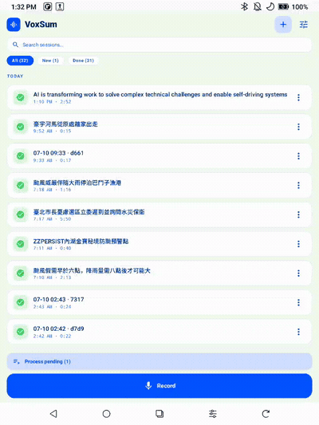

<p align="center">
  
</p>

<h1 align="center">VoxSum pour Android</h1>

<p align="center">
  <b>Transformez n'importe quel audio en une transcription claire, avec les intervenants identifiés,<br>et un résumé concis — entièrement sur votre téléphone, hors ligne.</b>
</p>

<p align="center">
  <a href="https://github.com/vieenrose/VoxSumDroid/releases/latest"></a>
  
  
  
</p>

<p align="center"><a href="README.md">English →</a> · <a href="README.zh-TW.md">繁體中文說明 →</a></p>

---

Enregistrez une réunion, ouvrez un mémo vocal, glissez un podcast ou un lien YouTube — VoxSum écrit
**qui a dit quoi**, puis vous donne un **résumé concis** dans la langue de votre choix. Tout se passe
**sur l'appareil** : sans compte, sans cloud, sans abonnement, et rien ne quitte jamais votre téléphone.

VoxSum est un **studio d'enregistrement** : l'écran d'accueil est votre **liste de sessions**, chaque
enregistrement est **auto-sauvegardé dès l'arrêt du micro** (un plantage ou un geste malheureux ne
peut plus rien vous faire perdre), et **l'enregistrement n'attend jamais le traitement** — enchaînez
les interventions toute la journée, puis laissez l'appli les transcrire et les résumer une par une
pendant que vous suivez le statut de chaque session en direct.

> Vous débutez ? Le **[guide de démarrage en 5 minutes →](docs/QUICKSTART.fr.md)** présente chaque fonction.

<p align="center"></p>
<p align="center"><i>Ouvrir une session terminée : le résumé, la transcription étiquetée par locuteur, et la lecture au toucher avec la ligne courante surlignée.</i></p>

## Pourquoi VoxSum

- 🛡️ **Confidentiel par conception** — votre audio ne quitte jamais le téléphone, vos enregistrements sensibles ne fuiteront pas vers un cloud.
- ✈️ **Fonctionne hors ligne** — une fois configuré, aucun réseau n'est nécessaire : en avion, en train, ou loin de tout.
- 💰 **Sans abonnement** — à vous pour de bon. Pas de minutes facturées, pas d'abonnement mensuel.

## Captures d'écran

<p align="center">
  
  
  
  
</p>
<p align="center"><i>L'accueil studio (liste des sessions avec statuts en direct) · transcription en direct avec intervenants · résumé · choix de la langue du résumé</i></p>

## Ce que vous pouvez faire

**🎛️ Travaillez comme dans un studio**
- **L'accueil est votre liste de sessions** — chaque enregistrement, avec son statut en direct : *Non traité · En attente · Traitement (phase et %) · Terminé*.
- **Enchaînez les interventions** — une cabine d'enregistrement plein écran avec un grand minuteur, des barres de niveau micro et deux boutons géants : **⏭ Session suivante** termine une session et démarre immédiatement la suivante (traitement différé) ; **⏹ Arrêter et sauvegarder** sauvegarde puis traite en arrière-plan pendant que vous êtes déjà libre de réenregistrer.
- **Impossible de perdre un enregistrement** — l'audio est sauvegardé dès que le micro s'arrête, même en cas de plantage ou d'arrêt accidentel ; les sessions terminées embarquent automatiquement leur transcription + résumé dans un `.m4a` autonome.
- **Traitez quand vous voulez** — *Traiter en attente (n)* transcrit, identifie les locuteurs, résume et titre chaque enregistrement sauvegardé, en arrière-plan. Les lots sont traités **efficacement** : tout est d'abord transcrit, puis le modèle de résumé se charge **une seule fois** pour tout le lot — et la file survit aux arrêts de l'appli, en reprenant sans jamais refaire le travail terminé.
- **Gérez vos fichiers** — touchez ou appuyez longuement sur une session : *Traiter maintenant · Renommer · Partager l'audio · Supprimer* — plus *Retirer de la file* sur une session en attente et *Arrêter le traitement* sur celle en cours. Nommez une session pendant l'enregistrement — votre nom prime toujours sur le titre généré par l'IA.

**🎙️ Importez de l'audio depuis n'importe où**
- **Un fichier** de votre appareil — la plupart des formats audio et vidéo courants fonctionnent.
- **Partagé depuis une autre appli** — envoyez une note vocale ou un fichier audio/vidéo directement à VoxSum (depuis LINE, un dictaphone, votre navigateur…) et la transcription démarre.
- **Enregistrez en direct** — voyez la transcription apparaître phrase après phrase pendant que vous parlez (bandeau repliable dans la cabine d'enregistrement), avec des **barres de niveau micro**.
- **Un podcast** — cherchez, choisissez un épisode et transcrivez-le.
- **Un lien YouTube** — collez une URL, ou cherchez par mot-clé.
- **Rouvrez une session enregistrée** — touchez n'importe quelle session *Terminé* de la liste et reprenez exactement là où vous vous étiez arrêté.

**📝 Lisez et comprenez**
- **Transcription en direct** — les lignes apparaissent dès que vous parlez ; vous pouvez lire (et écouter) avant la fin.
- **Qui a parlé, et quand** — chaque ligne est étiquetée et colorée par intervenant, avec leur nombre. VoxSum peut même **deviner le vrai nom des intervenants** d'après leurs propos.
- **Un résumé dans votre langue, à votre façon** — un titre court et un résumé **en puces, en synthèse ou en récit**. Gardez la langue de la transcription, ou choisissez **English · Français · 繁體中文 · 简体中文 · 日本語 · 한국어**. (Par défaut, la langue de votre téléphone.)
- **Actions et décisions** — tirez d'une réunion une liste (modifiable) de qui-fait-quoi et des décisions clés.
- **Cherchez dans la transcription** — trouvez n'importe quel mot dans un long enregistrement ; les résultats se surlignent et vous pouvez les parcourir.
- **Un lecteur intégré et synchronisé** — ancré en bas comme une appli musicale : touchez une ligne pour y sauter, et la ligne en cours se surligne pendant la lecture.
- **Confortable pour les yeux** — thèmes **Clair**, **Sombre**, ou un thème **E-ink** plat à fort contraste conçu pour les liseuses (Boox et similaires). **Auto** — le réglage par défaut — suit le mode clair/sombre du système. Changez-en à tout moment dans **Paramètres → Apparence**.

**✏️ Personnalisez**
- **Modifiez tout** — corrigez un mot, renommez un intervenant, ajustez le titre ou le résumé, sur place.
- **Corrigez les intervenants** — déplacez une ligne mal attribuée vers la bonne personne, ou fusionnez deux intervenants.
- **Copiez** tout le résumé d'un seul geste.
- **Exportez le texte** — copiez ou partagez la transcription en texte, ou enregistrez des **sous-titres (`.srt`/`.vtt`)**, du texte brut, du Markdown ou un **PDF** imprimable pour d'autres applis.
- **Relancez** la transcription, le résumé ou la détection des noms quand vous voulez — et VoxSum garde le tout cohérent : changez la langue ou le style du résumé (ou modifiez la transcription) et il propose un **re-résumé** en un geste, qui rafraîchit aussi le titre (sauf si vous l'avez écrit vous-même). Un simple passage entre **繁體中文 ↔ 简体中文** convertit le titre, le résumé et la transcription **instantanément**, sans relance.
- **Enregistrez ou partagez en un seul fichier** — toute la session (audio + transcription + résumé + intervenants + une pochette) tient dans un unique **`.m4a`** qui **se lit dans n'importe quelle appli musicale** (avec le titre, la pochette, le résumé et la **transcription synchronisée** en paroles — voir [*Paroles synchronisées dans les lecteurs Android*](#paroles-synchronisées-dans-les-lecteurs-android)) et **se rouvre dans VoxSum** avec tout intact. (`.m4a` a la plus large compatibilité — iPhone, autoradios, tous les lecteurs ; les anciennes sessions `.ogg` s'ouvrent toujours.)

## Langues

- **La transcription** gère le chinois et l'anglais d'emblée ; un moteur multilingue (chinois · anglais · japonais · coréen · cantonais) est à un tap dans les **Réglages**.
- **Les résumés** peuvent être écrits dans l'une de sept langues, ou alignés sur la transcription.
- **L'application elle-même** est disponible en **anglais, 繁體中文 et français**.

## Installation

Les petits modèles d'IA ne sont **pas** inclus — ils se téléchargent une fois à la première utilisation,
puis l'appli fonctionne entièrement hors ligne. Deux façons d'installer :

**Via F-Droid (recommandé — mises à jour automatiques).** Dans votre client F-Droid, ajoutez ce dépôt
(**Paramètres → Dépôts → ➕**), puis installez VoxSum depuis celui-ci :

```
https://vieenrose.github.io/VoxSumDroid/repo?fingerprint=c9fe46eb7d87d4fa4e2340a73f78a602eafbab655cbe7c7cb4ead5ab7a00b088
```

 &nbsp; *(ou scannez pour ajouter le dépôt)*

C'est un dépôt auto-hébergé (pas le magasin officiel f-droid.org), donc l'ajout est une étape unique —
ensuite, les mises à jour arrivent toutes seules.

**Installez l'APK manuellement.** Téléchargez le dernier APK signé depuis la
[**page Releases**](https://github.com/vieenrose/VoxSumDroid/releases/latest) et ouvrez-le pour
l'installer (Android peut demander l'autorisation d'installer depuis votre navigateur ou gestionnaire de fichiers).

## Bon à savoir

- **Le premier lancement télécharge des modèles.** La première fois que vous utilisez une fonction,
  VoxSum récupère le modèle nécessaire depuis **Hugging Face** (avec GitHub en secours), vérifie son
  intégrité et le met en cache. Ensuite, vous pouvez passer entièrement hors ligne. Si un téléchargement
  s'interrompt ou qu'un fichier de modèle est corrompu, VoxSum le nettoie automatiquement et propose un
  **Réessayer** en un geste.
- **Pendant une transcription,** les exports et les réglages sont brièvement verrouillés pour éviter
  d'enregistrer une session à moitié finie — ils se déverrouillent dès la fin.
- **La seule chose jamais envoyée** est une vérification facultative, une fois par jour, vers GitHub
  pour une nouvelle version — sans aucun pistage, et ignorée hors ligne. (Les utilisateurs F-Droid
  reçoivent les mises à jour via leur client.)
- **Fonctionne sous Android 8.0+.** Un téléphone récent avec quelques Go d'espace libre est confortable ;
  le modèle de résumé de meilleure qualité est optionnel et peut être désactivé dans les Réglages
  pour les appareils plus légers.

## Paroles synchronisées dans les lecteurs Android

Un fichier `.m4a` exporté stocke le titre, la pochette, le **résumé** (dans la balise *commentaire*)
et la **transcription synchronisée** (dans la balise *paroles/lyrics*, au format LRC `[mm:ss.xx]`). Les
lecteurs Android qui interprètent les **paroles synchronisées** font défiler la transcription **en temps
réel** pendant la lecture — lue directement depuis le fichier, **sans annexe ni permission**. (Les lecteurs
sans synchro affichent simplement le texte, avec les horodatages `[mm:ss]` visibles.)

| Appli | Où ouvrir les paroles | Synchro temps réel |
|---|---|---|
| **Retro Music** *(gratuit)* | en lecture (歌詞) | ✅ |
| **Gramophone** *(gratuit)* | la vue Paroles | ✅ |
| **Musicolet** *(gratuit)* | appui sur la pochette → paroles | ✅ |

<p align="center">

&nbsp;
&nbsp;
</p>

*Transcription synchronisée qui défile sur un Pixel — **Retro Music**, **Gramophone** et **Musicolet** (la ligne en cours se surligne pendant la lecture).*

> **Remarques.** Les trois sont vérifiés sur un Pixel — la ligne en cours se surligne pendant la lecture. Le
> **résumé** figure aussi dans la balise **commentaire** standard. Un export **`.lrc` annexe** (**Exporter →
> « Enregistrer les paroles synchronisées (.lrc) »**) est aussi disponible pour les lecteurs qui le préfèrent.

## Pour les développeurs

VoxSum est un portage sur appareil de [VoxSum Studio](https://huggingface.co/spaces/Luigi/VoxSum-bak).
Il exécute la reconnaissance vocale, la séparation des locuteurs et le modèle de résumé localement via
[sherpa-onnx](https://github.com/k2-fsa/sherpa-onnx) et [llama.cpp](https://github.com/ggml-org/llama.cpp),
le tout compilé depuis les sources. Voir [`ARCHITECTURE.md`](ARCHITECTURE.md) pour la carte des modules ;
les instructions de compilation sont dans le [README anglais](README.md#build-from-source).

## Licence

[GPL-3.0-or-later](LICENSE). Les dépendances source incluses conservent leur propre licence ; le modèle
de résumé est distribué selon les [Gemma Terms](https://ai.google.dev/gemma/terms).
