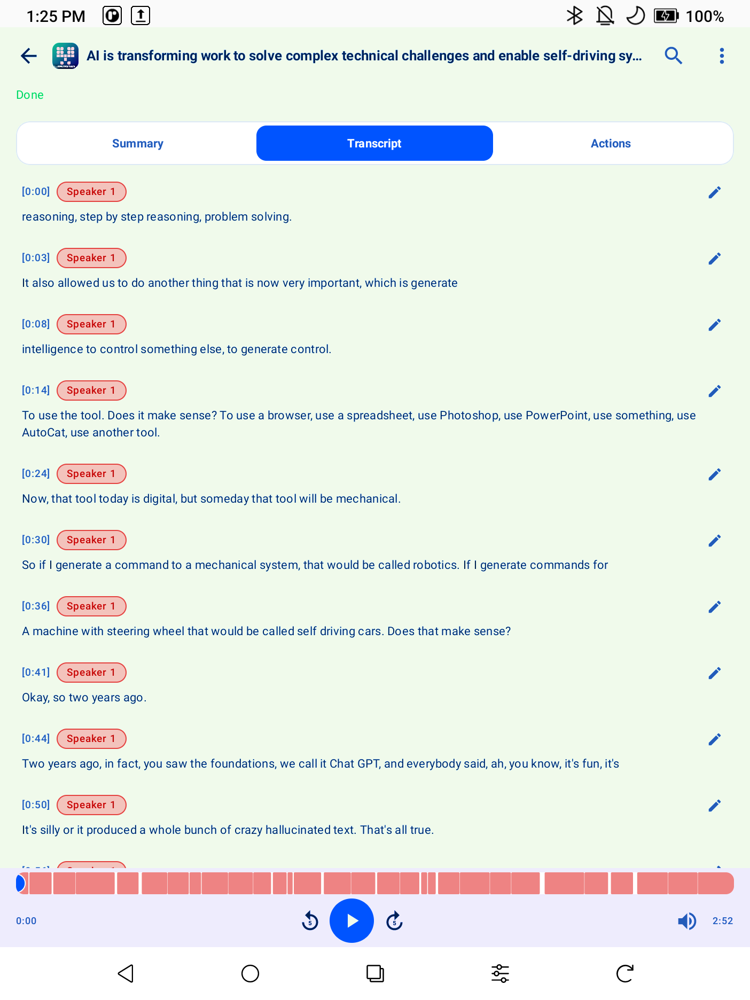
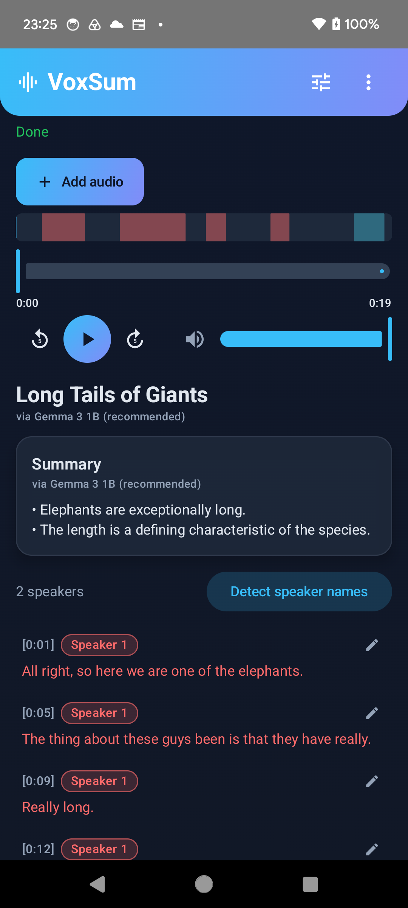
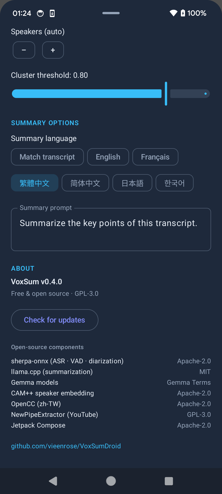

<p align="center">
  
</p>

<h1 align="center">VoxSum pour Android</h1>

<p align="center">
  <b>Transformez n'importe quel audio en une transcription claire, avec les intervenants identifiés,<br>et un résumé concis — entièrement sur votre téléphone, hors ligne.</b>
</p>

<p align="center">
  <a href="https://github.com/vieenrose/VoxSumDroid/releases/latest"></a>
  
  
  
</p>

<p align="center"><a href="README.md">English →</a> · <a href="README.zh-TW.md">繁體中文說明 →</a></p>

---

Enregistrez une réunion, ouvrez un mémo vocal, glissez un podcast ou un lien YouTube — VoxSum écrit
**qui a dit quoi**, puis vous donne un **résumé concis** dans la langue de votre choix. Tout se passe
**sur l'appareil** : sans compte, sans cloud, sans abonnement, et rien ne quitte jamais votre téléphone.

## Pourquoi VoxSum

- 🛡️ **Confidentiel par conception** — votre audio ne quitte jamais le téléphone, vos enregistrements sensibles ne fuiteront pas vers un cloud.
- ✈️ **Fonctionne hors ligne** — une fois configuré, aucun réseau n'est nécessaire : en avion, en train, ou loin de tout.
- 💰 **Sans abonnement** — à vous pour de bon. Pas de minutes facturées, pas d'abonnement mensuel.

## Captures d'écran

<p align="center">
  
  
  
  
</p>
<p align="center"><i>Accueil · transcription en direct avec intervenants · résumé · choix de la langue du résumé</i></p>

## Ce que vous pouvez faire

**🎙️ Importez de l'audio depuis n'importe où**
- **Un fichier** de votre appareil — la plupart des formats courants fonctionnent.
- **Enregistrez en direct** — captez une réunion et voyez la transcription apparaître phrase après phrase.
- **Un podcast** — cherchez, choisissez un épisode et transcrivez-le.
- **Un lien YouTube** — collez une URL, ou cherchez par mot-clé.
- **Rouvrez une session enregistrée** — reprenez exactement là où vous vous étiez arrêté (voir plus bas).

**📝 Lisez et comprenez**
- **Transcription en direct** — les lignes apparaissent dès que vous parlez ; vous pouvez lire (et écouter) avant la fin.
- **Qui a parlé, et quand** — chaque ligne est étiquetée et colorée par intervenant, avec leur nombre. VoxSum peut même **deviner le vrai nom des intervenants** d'après leurs propos.
- **Un résumé dans votre langue** — un titre court et un résumé à puces. Gardez la langue de la transcription, ou choisissez **English · Français · 繁體中文 · 简体中文 · 日本語 · 한국어**. (Par défaut, la langue de votre téléphone.)
- **Un lecteur intégré et synchronisé** — ancré en bas comme une appli musicale : touchez une ligne pour y sauter, et la ligne en cours se surligne pendant la lecture.

**✏️ Personnalisez**
- **Modifiez tout** — corrigez un mot, renommez un intervenant, ajustez le titre ou le résumé, sur place.
- **Copiez** tout le résumé d'un seul geste.
- **Relancez** la transcription, le résumé ou la détection des noms quand vous voulez — p. ex. changez la langue du résumé puis relancez-le.
- **Enregistrez ou partagez en un seul fichier** — toute la session (audio + transcription + résumé + intervenants + une pochette) tient dans un unique `.ogg` qui **se lit dans n'importe quelle appli musicale** et **se rouvre dans VoxSum** avec tout intact.

## Langues

- **La transcription** gère le chinois et l'anglais d'emblée ; un moteur multilingue (chinois · anglais · japonais · coréen · cantonais) est à un tap dans les **Réglages**.
- **Les résumés** peuvent être écrits dans l'une de sept langues, ou alignés sur la transcription.
- **L'application elle-même** est disponible en **anglais, 繁體中文 et français**.

## Installation

Les petits modèles d'IA ne sont **pas** inclus — ils se téléchargent une fois à la première utilisation,
puis l'appli fonctionne entièrement hors ligne. Deux façons d'installer :

**Via F-Droid (recommandé — mises à jour automatiques).** Dans votre client F-Droid, ajoutez ce dépôt
(**Paramètres → Dépôts → ➕**), puis installez VoxSum depuis celui-ci :

```
https://vieenrose.github.io/VoxSumDroid/repo?fingerprint=c9fe46eb7d87d4fa4e2340a73f78a602eafbab655cbe7c7cb4ead5ab7a00b088
```

 &nbsp; *(ou scannez pour ajouter le dépôt)*

C'est un dépôt auto-hébergé (pas le magasin officiel f-droid.org), donc l'ajout est une étape unique —
ensuite, les mises à jour arrivent toutes seules.

**Installez l'APK manuellement.** Téléchargez le dernier APK signé depuis la
[**page Releases**](https://github.com/vieenrose/VoxSumDroid/releases/latest) et ouvrez-le pour
l'installer (Android peut demander l'autorisation d'installer depuis votre navigateur ou gestionnaire de fichiers).

## Bon à savoir

- **Le premier lancement télécharge des modèles.** La première fois que vous utilisez une fonction,
  VoxSum récupère le modèle nécessaire (avec vérification d'intégrité) et le met en cache. Ensuite,
  vous pouvez passer entièrement hors ligne.
- **La seule chose jamais envoyée** est une vérification facultative, une fois par jour, vers GitHub
  pour une nouvelle version — sans aucun pistage, et ignorée hors ligne. (Les utilisateurs F-Droid
  reçoivent les mises à jour via leur client.)
- **Fonctionne sous Android 8.0+.** Un téléphone récent avec quelques Go d'espace libre est confortable ;
  le modèle de résumé de meilleure qualité est optionnel et peut être désactivé dans les Réglages
  pour les appareils plus légers.

## Pour les développeurs

VoxSum est un portage sur appareil de [VoxSum Studio](https://huggingface.co/spaces/Luigi/VoxSum-bak).
Il exécute la reconnaissance vocale, la séparation des locuteurs et le modèle de résumé localement via
[sherpa-onnx](https://github.com/k2-fsa/sherpa-onnx) et [llama.cpp](https://github.com/ggml-org/llama.cpp),
le tout compilé depuis les sources. Voir [`ARCHITECTURE.md`](ARCHITECTURE.md) pour la carte des modules ;
les instructions de compilation sont dans le [README anglais](README.md#build-from-source).

## Licence

[GPL-3.0-or-later](LICENSE). Les dépendances source incluses conservent leur propre licence ; le modèle
de résumé est distribué selon les [Gemma Terms](https://ai.google.dev/gemma/terms).
