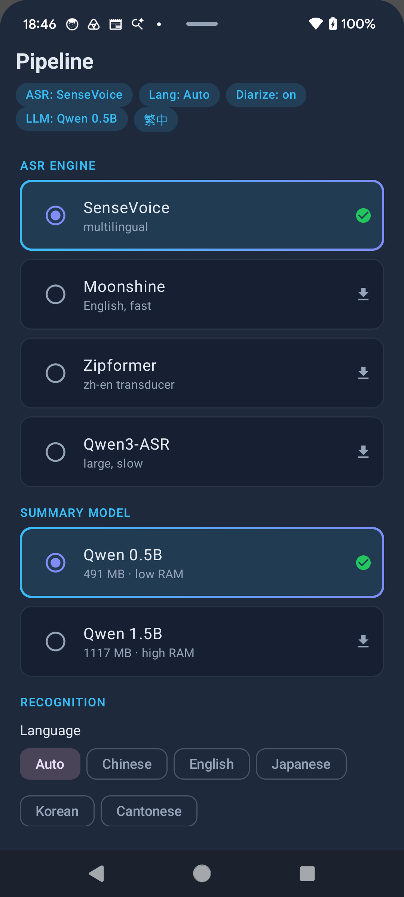

<p align="center">
  
</p>

# VoxSum for Android

Fully **offline**, on-device port of [VoxSum Studio](https://huggingface.co/spaces/Luigi/VoxSum-bak) —
transcribe, diarize, and summarize audio entirely on your phone. No server, no account, no cloud.
Pick an audio file (or a podcast episode), and everything — speech recognition, speaker
separation, and LLM summarization — runs locally on the device.

> **Status: working.** The full pipeline runs end-to-end on real hardware (verified on a
> Pixel 6): VAD-segmented ASR → diarization → summarization, with a transcript-synced audio
> player. Distribution is via **APK** (see [Releases](https://github.com/vieenrose/VoxSumDroid/releases)).

## Download

Grab the latest signed APK from the
[**Releases page**](https://github.com/vieenrose/VoxSumDroid/releases/latest)
(`voxsum-v<version>.apk`) and sideload it. Android may prompt to allow installing from your
browser/file manager. The ASR/diarization/LLM models are **not** bundled — they download once
(SHA-256-verified) on first use, then everything is offline.

## Screenshots

| Home | Models (ASR + LLM) | Transcript · diarization · player | Summary |
|:---:|:---:|:---:|:---:|
|  |  |  |  |

## Features

- **Four ASR backends**, selectable per run:
  - **SenseVoice** (multilingual — Chinese / English / Japanese / Korean / Cantonese, with language + ITN options)
  - **Moonshine** (English, fast)
  - **Zipformer zh-en** (transducer)
  - **Qwen3-ASR** (large, high accuracy)
- **Live recording** — record a meeting and **transcribe as you speak**: the mic streams straight into the VAD/ASR loop so utterances appear in real time, then diarization + summary run when you stop (the recording is saved to a WAV and playable in the synced player).
- **VAD-segmented streaming transcription** — utterances appear incrementally as speech is detected (Silero VAD), not in one blocking batch.
- **Speaker diarization** — pyannote segmentation + 3D-Speaker embeddings + clustering, with a color-coded **timeline strip**, per-speaker pill chips, and a speaker-statistics panel (talk time, segment counts).
- **On-device summarization** — local GGUF LLM via llama.cpp (Qwen2.5-0.5B-Instruct by default, 1.5B optional), map-reduce over the transcript to produce a title + summary.
- **Traditional Chinese (zh-TW) output** — optional OpenCC `s2tw` conversion applied to the transcript, title, and summary (e.g. 平台 → 平臺), all on-device.
- **Transcript-synced audio player** — tap any utterance to seek, active line auto-highlights, ±5 s skip, volume/mute, and **playback works *while* transcription is still running**.
- **Inline editing** — edit utterance text and rename speakers directly in the transcript.
- **Exports** — transcript to **SRT / VTT / TXT / JSON**; summary to **Markdown / plain text** (via the system file picker).
- **Podcast ingestion** — search and browse podcasts (iTunes Search + RSS) and download an episode straight into the pipeline.
- **Private by design** — once models are present, transcription and summarization need no network. No Google Play Services, no analytics, no proprietary dependencies.

## Stack

| Concern | Implementation | License |
|---|---|---|
| ASR | sherpa-onnx `OfflineRecognizer` (SenseVoice / Moonshine / Zipformer / Qwen3) | Apache-2.0 |
| VAD | sherpa-onnx `Vad` (Silero) | Apache-2.0 |
| Diarization | sherpa-onnx `OfflineSpeakerDiarization` (pyannote seg + 3D-Speaker emb) | Apache-2.0 |
| Summarization | llama.cpp + Qwen2.5-Instruct Q4_K_M (GGUF) | MIT / Apache-2.0 |
| zh-TW conversion | OpenCC (`s2tw`) dictionaries, bundled | Apache-2.0 |
| Audio decode | Android MediaCodec (no ffmpeg) | platform |
| UI | Jetpack Compose (Material 3) | Apache-2.0 |

All native code is **built from source** (git submodules under `native/`); no prebuilt
`.aar`/`.so` is committed. The heavy part is building onnxruntime (a sherpa-onnx dependency),
which is built reproducibly from a pinned tag.

## Build from source

Requires Android Studio (Ladybug+), Android SDK 35, NDK 27.2.

```bash
git clone --recurse-submodules https://github.com/vieenrose/VoxSumDroid.git
cd VoxSumDroid
```

The native stack is build-verified from source for `arm64-v8a` (NDK 27.2): onnxruntime
v1.24.3, sherpa-onnx JNI, llama.cpp, and the Kotlin layer — no prebuilt binaries. Because
sherpa-onnx links against onnxruntime, build ORT first, then point the app build at it:

```bash
# 1. Build onnxruntime from source for Android (the slow step). Pinned to v1.24.3.
./scripts/build-onnxruntime-android.sh
# 2. Hand its outputs to the app's CMake, then build.
export SHERPA_ONNXRUNTIME_LIB_DIR="$HOME/ort-build/Release"
export SHERPA_ONNXRUNTIME_INCLUDE_DIR="$HOME/ort-headers"
./gradlew :app:assembleDebug          # arm64-v8a by default
# For the emulator: ./gradlew :app:assembleDebug -PvoxsumAbi=x86_64
```

See [`SPIKE.md`](SPIKE.md) for the proven recipe and the one gotcha (TTS/espeak-ng disabled),
and [`ARCHITECTURE.md`](ARCHITECTURE.md) for how the modules map to the original Python app.

Models are **not** bundled; they download (SHA-256-verified) on first run, or can be
side-loaded into the app's models dir to stay network-free — see
[`models/manifest.json`](models/manifest.json).

## Releasing

Tagging `v*` triggers CI to build a signed release APK and attach it to a GitHub Release.
See [`RELEASING.md`](RELEASING.md).

## License

GPL-3.0-or-later (see [`LICENSE`](LICENSE)). Bundled source dependencies keep their own licenses.
