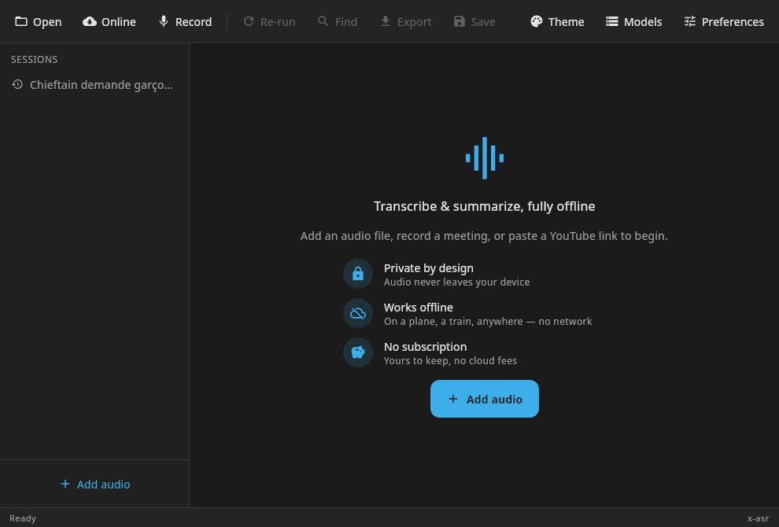
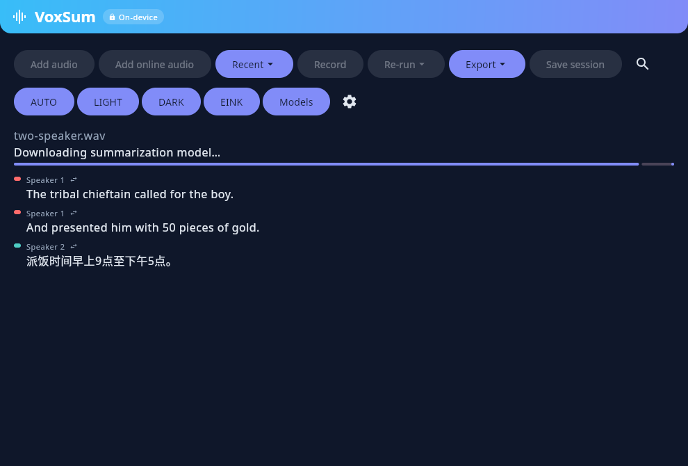
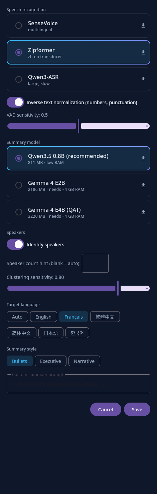
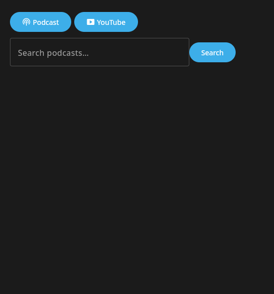

<p align="center">
  
</p>

<h1 align="center">VoxSum for Linux (desktop)</h1>

<p align="center">
  <b>Turn any audio into a clean, speaker-labelled transcript and a short summary —<br>entirely on your machine, fully offline.</b>
</p>

<p align="center">
  
  
  
</p>

---

This `linux` branch adds a **Compose Multiplatform desktop target** (Ubuntu/Kubuntu, x86_64) to
[VoxSumDroid](https://github.com/vieenrose/VoxSumDroid), the on-device Android port of
[VoxSum Studio](https://huggingface.co/spaces/Luigi/VoxSum-bak). It reuses the Android app's actual
Kotlin code — theme, settings, model provisioning, the full ASR/diarization/summarization pipeline
— rather than porting the older Python backend. For the Android app itself, see `README.md` on `main`.

**New here?** The [**Quick Start**](docs/QUICKSTART.md) is a 5-minute tour of everything the desktop
app does. This README covers the architecture, verified status, and how to build/package.

## Screenshots

<table>
  <tr>
    <td align="center"><br/><sub>Two-pane desktop layout — sessions sidebar + detail</sub></td>
    <td align="center"><br/><sub>Transcribed, diarized &amp; summarized — editable, synced audio player</sub></td>
  </tr>
  <tr>
    <td align="center"><br/><sub>Settings — ASR/LLM model pickers, language, diarization, summary options</sub></td>
    <td align="center"><br/><sub>Add online audio — podcast search</sub></td>
  </tr>
</table>

## Module layout

- **`:app`** — the Android app, unchanged.
- **`:shared`** — a Kotlin Multiplatform library (`jvm` + `androidTarget`) holding the code both
  platforms use: the theme system, settings persistence, model provisioning/downloads (`ModelManager`,
  HuggingFace-first), the ASR (`AsrEngine`) and diarization (`DiarizationEngine` — **segmentation-first**:
  pyannote segmentation-3.0 draws speaker boundaries at frame resolution, CAM++ embeddings +
  auto-k spectral clustering assign identities, `SpectralClustering`) engines, the
  summarization business logic (`LlmEngine`, `Summarizer`, `SpeakerNamer`, `ActionItemExtractor`),
  plus WAV/MP4/OGG tag I/O and transcript export. Its `jvmMain` also carries a desktop-only Kotlin
  JNI wrapper for sherpa-onnx (`com.k2fsa.sherpa.onnx`) — adapted from the upstream submodule, which
  is Android-only as shipped.
- **`:desktop`** — the Compose Multiplatform desktop app: a real (if minimal) screen driving the
  full pipeline, plus the desktop-native `AudioDecoder` (ffmpeg-backed), `AudioRecorder`
  (`javax.sound.sampled`), `FilePicker` (native AWT/GTK dialogs), and `NativeLibs` (package-portable
  native library loading — see below).

## Status

**Builds and runs as a real, installable `.deb`, verified end-to-end** — not just compiled or run
from the dev tree. Every item below was actually executed and observed:

- The real theme system (`VoxSumTheme`, Light/Dark/E-ink), settings persistence, and model
  provisioning (`ModelManager`, the same HuggingFace-first downloads as Android, downloading to
  `$XDG_DATA_HOME/VoxSum`) all run as on Android — `Context` swapped for a small `KeyValueStore`
  interface and plain `File` paths.
- `llama.cpp` + sherpa-onnx (ASR/VAD/diarization) both build natively for linux-x86_64
  (`desktop/scripts/build-native.sh`) — a host build, not a cross-compile.
- Desktop counterparts of Android's platform APIs: `AudioDecoder` (ffmpeg), `AudioRecorder`
  (`javax.sound.sampled`), `FilePicker` (native AWT/GTK dialogs) — each verified against real
  files/devices/dialogs, not mocks.
- **A real transcribe → diarize → summarize run, in the real UI**: transcribing a multi-speaker
  meeting produced a correct transcript, speakers split by the **segmentation-first** pipeline
  (a pyannote-3.0 neural segmenter marks where the voice changes; auto-k spectral clustering over
  CAM++ embeddings assigns identities — no distance threshold to hand-tune). Benchmarked on public
  meeting corpora: **AMI 95.6% / AISHELL-4 92.1% time-weighted speaker attribution** (16 + 6
  meetings, 10-minute excerpts). (Runs the exact same `DiarizationEngine` as the Android app.)
- **First-run model downloads work from the UI**: with no models present, the app correctly shows
  "Downloading speech/speaker/summarization model…" with a live progress bar and streams real bytes
  from HuggingFace over HTTPS; verified with a genuinely fresh, empty model directory.
- **Packages into a real, installable `.deb`** (`./gradlew :desktop:packageDeb`) containing a fully
  self-contained JRE and all native libraries. Verified by extracting the package outright (not just
  building it) and launching the actual binary from a directory unrelated to the build tree — every
  native library (llama.cpp/ggml, onnxruntime, sherpa-onnx, the voxsum-llm JNI bridge) was confirmed
  loaded and mapped into the running process's memory from inside the package layout.
- **Settings screen**: ASR backend, diarization on/off + optional speaker-count hint (the speaker
  count is otherwise automatic — no clustering-threshold knob), target language, and summary style,
  persisted via a JVM `KeyValueStore` (`java.util.prefs`) and the same shared
  `ConfigStore`/`TranscriptionConfig` Android uses.
- **Re-run actions**: re-summarize, LLM-based speaker-name detection, and action-item extraction —
  all reuse Android's shared `SpeakerNamer`/`ActionItemExtractor`, verified with a real run that
  correctly renamed a speaker and produced a real action-item list.
- **Export**: grouped by what you get — a **document** (PDF, Markdown, plain text) carrying the title, summary, action items and the timestamped transcript, or **subtitles** (SRT, VTT, LRC) with speaker labels — via the shared `TranscriptExport`. Section headings follow the UI language.
- **Speaker/text editing**: rename a speaker, reassign a single line to a different speaker, edit
  any utterance's text inline; a search bar filters the visible transcript.
- **Live recording**: mic capture → live ASR → diarize → summarize, verified with a real recording
  through the system's default input device end to end to a "Done" summary.
- **Model management**: a Models screen listing every downloaded model with size/kind and a Delete
  action to reclaim space (`ModelManager.storedModels()`, shared with Android).
- **Session save/reopen — full format parity with Android**: "Save session" writes a
  self-describing `.m4a` file (the default, matching Android) — or `.ogg` — with the audio transcoded
  to AAC/Opus via a system `ffmpeg` subprocess, an audio-seeded cover identicon embedded, and the
  full editable transcript gzip+base64'd into an MP4 freeform atom / Vorbis comment — the *same format*
  Android uses,
  reusing the shared `OggOpusTags`/`Mp4Tags` read/write code. Any media player plays it and shows
  title/description/synced lyrics; reopening it in VoxSum recovers the exact session. An earlier,
  simpler JSON-sidecar format (`SessionFile`) is still readable as a fallback for sessions saved
  before this was ported.
- **Speaker merge**: merge one speaker into another (not just reassigning individual lines), via
  the shared `SpeakerEdits.merge`.
- **Recent sessions**: a "Recent ▾" list of previously opened/saved sessions, backed by the same
  `KeyValueStore` settings use.
- **OpenCC script conversion**: Traditional/Simplified Chinese normalization for summaries and
  action items, using the same OpenCC dictionaries as Android (bundled as JVM classpath resources
  instead of APK assets).
- **PDF export**: via Apache PDFBox, with embedded CJK font support (looks for a system-installed
  Noto Sans CJK font).
- **Online audio sources**: podcast search (iTunes Search API) + RSS episode download, and YouTube
  audio resolution/download (via NewPipeExtractor, already a dependency on Android) — both verified
  against the live network.
- **Desktop reading comfort**: adjustable text size (the **A− / A+** buttons scale the transcript,
  title, and summary without disturbing the toolbar or player), and the transcript **auto-scrolls**
  to keep the currently-playing line in view. HiDPI is auto-detected on X11 (KDE/XFCE/GNOME), with a
  `VOXSUM_UI_SCALE` override.

Every item above was independently verified end-to-end (not just compiled) during development —
see the branch's commit history for the specific verification each one got.

## ASR benchmark (x86-64)

Every number below comes from the **byte-identical production pipeline** (the
`--bench` headless entry drives the same `Pipeline.kt` path the app runs,
diarization included) on two 5-minute clips — English and Taiwan-accented
Mandarin — against human references. Machine: AMD Ryzen 9 9950X3D (32 threads).
Error rates are normalized the standard way (Whisper `EnglishTextNormalizer`
for en; OpenCC script fold + digit→numeral, CJK-only for zh), wall clock
includes engine load, peak RSS is the process high-water mark.

| backend | en WER | zh-TW CER | wall en / zh | peak RSS | prefill | generation |
|---|---:|---:|---:|---:|---:|---:|
| **MOSS-TD** | **4.6%** | **6.71%** | 109 s / 157 s | 1.7 GB | ~790 tok/s | 18.7 tok/s |
| **X-ASR** | 11.4% | 11.53% | 7 s / 8 s | 0.5 GB | — | — |
| **Nemotron** | 11.9% | 22.70% | 16 s / 24 s | 1.1 GB | — | — |

The **zh-TW CER column is measured on held-out audio**: a 9-clip / 16.6-minute
FormosaSpeech set, scored with the usual normalizer (OpenCC s2t + per-digit
漢字 fold via cn2an + CJK-only filter, character CER). The figures above are the
common-subset scores; over all 9 clips they are MOSS-TD 7.74, X-ASR 12.25,
Nemotron 21.39. **All previously published zh-TW numbers are withdrawn and must
not be cited** — they came from a Common Voice 19.0 *test* concatenation, which
is in-domain for Nemotron (itself a Common-Voice-zh-TW fine-tune) and so
unlabelled in-domain for every zh figure we ever printed. The en column is
unaffected: it was measured on independent audio.

Prefill/generation apply only to MOSS-TD — the one autoregressive backend;
X-ASR and Nemotron emit tokens from a single forward pass. RTF: X-ASR ≈ 0.02,
Nemotron ≈ 0.06, MOSS-TD ≈ 0.35.

### Sample output (first seconds of each clip)

(The transcripts and the wall-clock/RSS columns still come from the original
two 5-minute clips; only the zh-TW CER column was re-measured on held-out audio.)

**English** — reference: *“When you call someone who is thousands of miles
away, you are using a satellite. Now widely available throughout the
archipelago, …”*

| backend | output |
|---|---|
| MOSS-TD | When you call someone who is thousands of miles away, you're using a satellite. Now widely available throughout the archipelago, … |
| X-ASR | When you call someone who is thousands of miles away. You're using a satellite. Now widely available throughout the Archipal ago. |
| Nemotron | when you call someone who is thousands of miles away. you're using a satellite. now widely available throughout the archipelago. … |

**zh-TW** — reference: *「在家也可以刷卡 外交與全球性議題 我們的人口結構急速老化 新店端 則正確…」*

| backend | output |
|---|---|
| MOSS-TD | 在家也可以刷卡。外交與全球性議題。我們的人口結構急速老化。新店端。則正確的說明了… |
| X-ASR | 在家也可以刷卡。外交與全球性議題 我們的人口結構急速老化。心電端。則正確地說明了… |
| Nemotron | 這家也可以刷卡 外交與全球信議題 我們的人口結構急速老化 新電端 則正確的說明了星球的大小… |

MOSS-TD is the accuracy pick and the only diarizing backend; X-ASR is the fast
default; Nemotron is there for **language breadth (25 languages), not Chinese
accuracy** — on held-out Taiwanese Mandarin it is ~2x worse than X-ASR and ~3x
worse than MOSS-TD, and it collapses on classical text (44.8 CER on 三國演義
against MOSS-TD's 2.2).
Four fixes were landed against these clips: VAD tail amputation and pre-roll
(both backends), head/tail silence context for Nemotron's strided encoder
(en 26.2 → 17.3 combined; the zh half of that measurement is withdrawn), a
per-backend pre-roll sweep (X-ASR pr=2, Nemotron pr=8), and a q8 encoder re-export for
Nemotron replacing the q4-mix at the same 599 MB — the q4 quantization alone
was costing ~6 en WER (en 17.3 → 11.9; the paired zh figure is withdrawn with
the rest of the old in-domain zh set). X-ASR additionally
needs the XNNPACK weight cache disabled: caching packs weights by tensor data,
so its four shared-weight bucketed encoder signatures collide and the larger
buckets decode to nothing. Clips are single runs on one machine; treat rows as
relative, not absolute.

## Build & run (development)

Requires a JDK (21 tested), `ffmpeg` on `PATH` for audio decoding, and `patchelf` (native-lib
packaging step; `pip install --user patchelf` if not packaged for your distro).

```bash
git clone --recurse-submodules https://github.com/vieenrose/VoxSumDroid.git
cd VoxSumDroid
git checkout linux

# Native libs needed for ASR/diarization/summarization (llama.cpp + sherpa-onnx + the JNI
# bridge; plain CMake/Ninja, no NDK involved — a host build, not a cross-compile). Also
# flattens + relocates them for packaging — see desktop/scripts/flatten-native-libs.sh.
./desktop/scripts/build-native.sh

# Desktop app — pick an audio file and it transcribes, diarizes, and summarizes it. Models
# download automatically on first use (see Status above).
./gradlew :desktop:run
```

See `desktop/src/jvmMain/cpp/CMakeLists.txt` for what the native build produces.

## Building a release `.deb`

After `./desktop/scripts/build-native.sh` (above):

```bash
./gradlew :desktop:packageDeb
```

Produces `desktop/build/compose/binaries/main/deb/voxsum_<version>_amd64.deb` — a self-contained
package (bundled JRE + all native libs) that installs to `/opt/voxsum`. Install normally:

```bash
sudo dpkg -i desktop/build/compose/binaries/main/deb/voxsum_*_amd64.deb
```

(An `AppImage` target is also configured — `./gradlew :desktop:packageAppImage` — for a
no-install-needed alternative.)

## License

[GPL-3.0-or-later](LICENSE), same as the Android app. The summarization model
(Qwen3.5 0.8B) is distributed under
[Apache-2.0](https://huggingface.co/Qwen/Qwen3.5-0.8B/blob/main/LICENSE).
