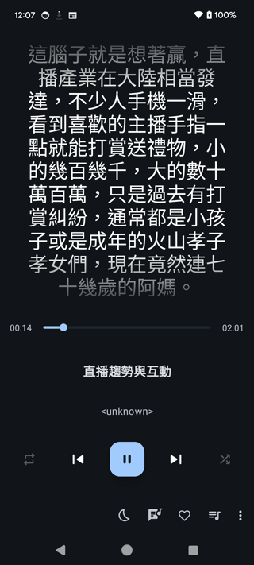
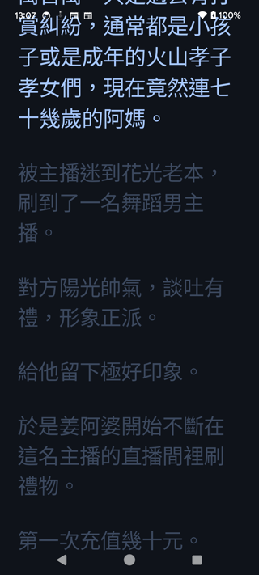
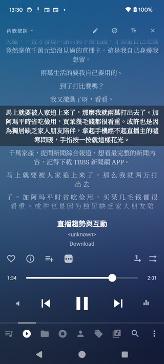

<p align="center">
  
</p>

<h1 align="center">VoxSum for Android</h1>

<p align="center">
  <b>Turn any audio into a clean, speaker-labelled transcript and a short summary —<br>entirely on your phone, fully offline.</b>
</p>

<p align="center">
  <a href="https://github.com/vieenrose/VoxSumDroid/releases/latest"></a>
  
  
  
</p>

<p align="center"><a href="README.zh-TW.md">繁體中文說明 →</a> · <a href="README.fr.md">Français →</a></p>

---

Record a meeting, open a voice memo, drop in a podcast or a YouTube link — VoxSum writes out **who said
what**, then gives you a **concise summary** in the language you choose. Everything happens **on the
device**: no account, no cloud, no subscription, and nothing ever leaves your phone.

> New here? The **[5-minute Quick Start →](docs/QUICKSTART.md)** walks through every feature.

## Why VoxSum

- 🛡️ **Private by design** — your audio never leaves the phone, so confidential recordings can't leak to a cloud.
- ✈️ **Works offline** — once set up, no network is needed: on a plane, a train, or off the grid.
- 💰 **No subscription** — own it outright. No metered minutes, no monthly fee.

## Screenshots

<p align="center">
  
  
  
  
</p>
<p align="center"><i>Home · live transcript with speakers · summary · summary-language picker</i></p>

## What you can do

**🎙️ Bring in audio from anywhere**
- **A file** on your device — most common audio and video formats work.
- **Share from another app** — send a voice note or an audio/video file straight to VoxSum (from LINE, a recorder, your browser…) and it starts transcribing.
- **Record live** — capture a meeting and watch the transcript appear sentence by sentence as you speak.
- **A podcast** — search, pick an episode, and transcribe it.
- **A YouTube link** — paste a URL, or search by keyword.
- **Reopen a saved session** — pick up exactly where you left off (see below); your **recent sessions** are one tap away on the home screen.

**📝 Read and understand**
- **Live transcript** — lines show up as soon as you speak; you can start reading (and playing) before it finishes.
- **Who spoke when** — each line is tagged and colour-coded by speaker, with a speaker count. VoxSum can even **guess speakers' real names** from what they say.
- **A summary in your language, your way** — a short title and a summary as **bullets, an executive brief, or a narrative**. Keep it in the transcript's language, or pick **English · Français · 繁體中文 · 简体中文 · 日本語 · 한국어**. (It defaults to your phone's language.)
- **Action items & decisions** — pull a draft checklist of who-does-what and the key decisions out of a meeting, ready to edit.
- **Search the transcript** — find any word in a long recording; matches highlight and you can step through them.
- **A built-in player, in sync** — docked at the bottom like a music app: tap any line to jump there, and the current line highlights as it plays.

**✏️ Make it yours**
- **Edit anything** — fix a word, rename a speaker, tweak the title or summary, right in place.
- **Fix the speakers** — move a misattributed line to the right person, or merge two speakers into one.
- **Copy** the whole summary with one tap.
- **Export the words** — copy or share the transcript as text, or save **subtitles (`.srt`/`.vtt`)**, plain text, Markdown, or a printable **PDF** for any other app.
- **Re-run** the transcription, the summary, or the speaker-name detection whenever you like — e.g. switch the summary language and re-summarize.
- **Save or share as one file** — the whole session (audio + transcript + summary + speakers + a cover) is packed into a single **`.ogg`** *or* **`.m4a`** that **plays in any music app** (and shows the title, cover, summary and transcript — see [*Synced lyrics in Android music players*](#synced-lyrics-in-android-music-players)) and **reopens in VoxSum** with everything intact. Pick `.m4a` for the widest compatibility (iPhones, cars, every player).

## Languages

- **Transcription** handles English and Chinese out of the box; a multilingual engine (Chinese · English · Japanese · Korean · Cantonese) is one tap away in **Settings**.
- **Summaries** can be written in any of seven languages, or matched to the transcript.
- **The app itself** is available in **English, 繁體中文, and Français**.

## Install

The small AI models are **not** bundled — they download once on first use, then the app runs fully
offline. Two ways to install:

**Via F-Droid (recommended — automatic updates).** In your F-Droid client, add this repository
(**Settings → Repositories → ➕**), then install VoxSum from it:

```
https://vieenrose.github.io/VoxSumDroid/repo?fingerprint=c9fe46eb7d87d4fa4e2340a73f78a602eafbab655cbe7c7cb4ead5ab7a00b088
```

 &nbsp; *(or scan to add the repo)*

It's a self-hosted repository (not the official f-droid.org store), so adding it is a one-time step —
after that, updates arrive automatically.

**Sideload the APK.** Download the latest signed APK from the
[**Releases page**](https://github.com/vieenrose/VoxSumDroid/releases/latest) and open it to install
(Android may ask for permission to install from your browser or file manager).

## Good to know

- **First run downloads models.** The first time you use a feature, VoxSum fetches the model it needs
  (verified for integrity) and caches it. After that you can go fully offline.
- **The only thing it ever sends** is an optional, once-a-day check to GitHub for a new version — no
  tracking, and skipped when you're offline. (F-Droid users get updates through their client instead.)
- **Runs on Android 8.0+.** A recent phone with a few GB of free storage is comfortable; the higher-
  quality summary model is optional and can be turned off in Settings for lighter devices.

## Synced lyrics in Android music players

An exported `.ogg`/`.m4a` stores the title, cover, **summary** (in the *comment* tag) and the
**time-synced transcript** (in the *lyrics* tag, as LRC `[mm:ss.xx]` lines). Android players that parse
**synced lyrics** scroll the transcript **in real time** as it plays — read straight from the file,
**no sidecar and no permission**. (Players without sync support show the text with the `[mm:ss]`
timestamps visible.) **Use the `.m4a`** — its `©lyr` tag is read more widely; `.ogg` synced is
player-dependent.

| App | Lyrics view | `.m4a` | `.ogg` |
|---|---|---|---|
| **Retro Music** *(free)* | now-playing (歌詞) | ✅ | ❌ |
| **Gramophone** *(free)* | the Lyrics view | ✅ | ✅ |
| **Musicolet** *(free)* | tap the album cover → lyrics | ✅ | 🔄 |
| **Poweramp** | the lyrics view | 🔄 | 🔄 |
| **Oto Music** *(free)* | the lyrics view | 🔄 | 🔄 |

<p align="center">

&nbsp;
&nbsp;
</p>

*Synced transcript scrolling on a Pixel — **Retro Music**, **Gramophone**, and **Musicolet** (the current line highlights as the audio plays).*

> **Notes.** ✅ = verified synced on a Pixel · ❌ = no synced lyrics · 🔄 = documented support (not tested
> here). The **summary** lives in the standard **comment** tag. A standalone **`.lrc` sidecar** export
> also exists, but Android 14 blocks players from reading sidecars (no all-files access) — which is why
> the lyrics are embedded.

## For developers

VoxSum is an on-device port of [VoxSum Studio](https://huggingface.co/spaces/Luigi/VoxSum-bak). It runs
speech recognition, speaker separation, and the summarization model locally via
[sherpa-onnx](https://github.com/k2-fsa/sherpa-onnx) and [llama.cpp](https://github.com/ggml-org/llama.cpp),
all built from source. See [`ARCHITECTURE.md`](ARCHITECTURE.md) for the module map; build instructions
are below.

### Build from source

Requires Android Studio (Ladybug+), SDK 35, NDK 27.2.

```bash
git clone --recurse-submodules https://github.com/vieenrose/VoxSumDroid.git
cd VoxSumDroid

# 1. Build onnxruntime for Android (the slow step; pinned to v1.24.3).
./scripts/build-onnxruntime-android.sh

# 2. Point the app build at it, then build.
export SHERPA_ONNXRUNTIME_LIB_DIR="$HOME/ort-build/Release"
export SHERPA_ONNXRUNTIME_INCLUDE_DIR="$HOME/ort-headers"
./gradlew :app:assembleDebug          # arm64-v8a by default
```

See [`SPIKE.md`](SPIKE.md) for the proven recipe and [`RELEASING.md`](RELEASING.md) for how tagging
`v*` produces a signed release APK via CI.

## License

[GPL-3.0-or-later](LICENSE). Bundled source dependencies retain their own licenses; the summarization
model is distributed under the [Gemma Terms](https://ai.google.dev/gemma/terms).
