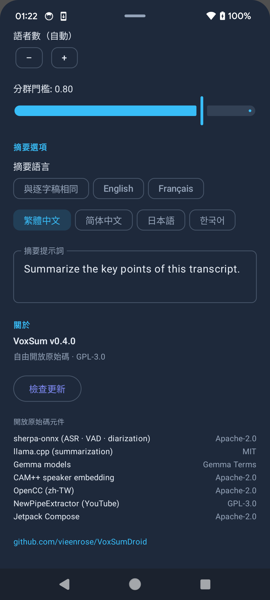

<p align="center">
  
</p>

<h1 align="center">VoxSum for Android</h1>

<p align="center">
  <b>把任何聲音，變成標註語者的逐字稿與精簡摘要 —<br>全程在手機上完成，完全離線。</b>
</p>

<p align="center">
  <a href="https://github.com/vieenrose/VoxSumDroid/releases/latest"></a>
  
  
  
</p>

<p align="center"><a href="README.md">English →</a> · <a href="README.fr.md">Français →</a></p>

---

錄一場會議、打開一段語音備忘、丟進一集 Podcast 或一條 YouTube 連結 —— VoxSum 會幫你寫出**誰說了什麼**，
再用你選的語言給出一份**精簡摘要**。一切都在**裝置端**完成：無需帳號、無需雲端、無需訂閱，聲音也永遠不會離開你的手機。

> 剛接觸嗎？**[5 分鐘快速上手 →](docs/QUICKSTART.zh-TW.md)** 帶你走過每一項功能。

## 為什麼選擇 VoxSum

- 🛡️ **絕對隱私** —— 音訊永遠不離開手機，機密錄音不會外洩到雲端。
- ✈️ **完全離線** —— 設定完成後即無需網路：在飛機、高鐵，或任何收不到訊號的地方都能用。
- 💰 **無需訂閱** —— 一次擁有，永久使用。沒有用量計費，也沒有月費。

## 螢幕截圖

<p align="center">
  
  
  
  
</p>
<p align="center"><i>首頁 · 帶語者的即時逐字稿 · 摘要 · 摘要語言選擇</i></p>

## 你可以做什麼

**🎙️ 從各種來源匯入音訊**
- **裝置上的檔案** —— 支援多數常見的音訊與影片格式。
- **從其他 App 分享進來** —— 從 LINE、錄音 App 或瀏覽器，把語音訊息或音訊／影片檔直接分享給 VoxSum，立即開始轉錄。
- **即時錄音** —— 一邊錄會議，一邊看著逐字稿逐句出現。
- **Podcast** —— 搜尋、挑一集，直接轉成逐字稿。
- **YouTube 連結** —— 貼上網址，或用關鍵字搜尋。
- **重新開啟已存的工作階段** —— 從上次離開的地方無縫接續（見下方）；**最近的工作階段**就在首頁，一鍵即可開啟。

**📝 閱讀與理解**
- **即時逐字稿** —— 話一說出口，句子就出現；轉錄還沒結束就能先讀、先播放。
- **誰在何時說話** —— 每一句都依語者標註並以顏色區分，並顯示語者數量。VoxSum 還能**從談話內容推測語者的真實姓名**。
- **以你想要的方式、用你的語言呈現摘要** —— 一個簡短標題，以及**條列、重點或敘述**式的摘要。可與逐字稿同語言，或自選 **English · Français · 繁體中文 · 简体中文 · 日本語 · 한국어**。（預設為你手機的語言。）
- **行動項目與決議** —— 從會議中整理出「誰該做什麼」的待辦清單草稿與關鍵決議，可直接編輯。
- **搜尋逐字稿** —— 在長篇錄音中一鍵找出任何字詞；符合處會高亮，並可逐一切換。
- **與逐字稿同步的內建播放器** —— 像音樂播放器一樣固定在底部：點任一句即可跳到該處，播放時當下那一句會自動高亮。

**✏️ 隨你編輯**
- **任意修改** —— 改一個字、重新命名語者、調整標題或摘要，都能直接在原處進行。
- **修正語者** —— 把標錯的句子改到正確的人，或把兩個語者合併為一個。
- 一鍵**複製**整段摘要。
- **匯出文字** —— 複製或分享逐字稿純文字，或另存**字幕（`.srt`／`.vtt`）**、純文字、Markdown 或可列印的 **PDF**，供其他 App 使用。
- 隨時**重新執行**轉錄、摘要或語者姓名偵測 —— 例如換個摘要語言再重新摘要一次。
- **存成或分享為單一檔案** —— 整個工作階段（音訊＋逐字稿＋摘要＋語者＋封面）打包成一個 **`.ogg`** 或 **`.m4a`**，**在任何播放器都能播**（並顯示標題、封面、摘要與逐字稿——見[*在其他音樂程式中檢視逐字稿與摘要*](#在其他音樂程式中檢視逐字稿與摘要)），**用 VoxSum 開啟時所有內容也完整保留**。想要最廣的相容性（iPhone、車機、各種播放器）就選 `.m4a`。

## 語言

- **轉錄**內建支援中文與英文；在**設定**裡一鍵即可切換到多語言引擎（中文 · 英文 · 日文 · 韓文 · 粵語）。
- **摘要**可用七種語言撰寫，或與逐字稿同語言。
- **App 本身**提供 **English、繁體中文、Français** 三種介面。

## 安裝

App **不**內建 AI 模型 —— 首次使用某功能時會下載一次，之後即可完全離線使用。有兩種安裝方式：

**透過 F-Droid（推薦 —— 自動更新）。** 在 F-Droid 用戶端中加入此軟體庫（**設定 → 軟體庫 → ➕**），
再從中安裝 VoxSum：

```
https://vieenrose.github.io/VoxSumDroid/repo?fingerprint=c9fe46eb7d87d4fa4e2340a73f78a602eafbab655cbe7c7cb4ead5ab7a00b088
```

 &nbsp; *（或掃描以加入軟體庫）*

這是自架軟體庫（非官方 f-droid.org 商店），加入為一次性步驟；之後更新就會自動送達。

**側載 APK。** 從 [**Releases 頁面**](https://github.com/vieenrose/VoxSumDroid/releases/latest)
下載最新的已簽署 APK 並開啟安裝（Android 可能會要求授權從瀏覽器或檔案管理器安裝）。

## 須知

- **首次執行會下載模型。** 第一次使用某項功能時，VoxSum 會下載所需模型（並驗證完整性）並快取起來；
  之後就能完全離線。
- **唯一會送出的資料**，是每天最多一次、向 GitHub 查詢有無新版本的請求 —— 無任何追蹤，離線時自動略過。
  （F-Droid 用戶則由用戶端負責更新。）
- **支援 Android 8.0 以上。** 一支具備幾 GB 可用空間的近代手機即可順暢運作；品質更高的摘要模型為選用，
  可在設定中關閉以適配較輕量的裝置。

## 在其他音樂程式中檢視逐字稿與摘要

匯出的 `.ogg`/`.m4a` 會把標題、封面、**摘要**（存在*註解 comment* 標籤）以及
**逐行同步的逐字稿**（存在*歌詞 lyrics* 標籤，以 LRC `[mm:ss.xx]` 格式）寫成一般的音訊中繼資料。
能解析**同步歌詞**的播放器會隨播放**即時捲動**逐字稿——直接從檔案讀取，**不需旁檔、不需權限**。
不支援同步的播放器仍會顯示文字（但會看到 `[mm:ss]` 時間軸）。建議用 **`.m4a`** 以取得最廣的相容性。

| 平台 | 程式 | 歌詞顯示位置 | 即時？ |
|---|---|---|---|
| **Android** | **Retro Music** *(免費)* — 已驗證 | 播放畫面歌詞（歌詞） | ✅ 同步 |
| | **Gramophone** *(免費)* — 已驗證 | 歌詞檢視 | ✅ 同步 |
| | **Musicolet** / **Oto Music** *(免費)* | **歌詞**分頁 | 🔄 同步 |
| | **Poweramp** | 歌詞檢視 | 🔄 同步 |
| **Windows** | **MusicBee** *(免費)* | **Lyrics** 面板 | 🔄 同步 |
| | **foobar2000** *(免費)* | 歌詞元件（ESLyric） | 🔄 同步 |
| | **iTunes / Apple Music** | **Song Info → Lyrics** 分頁 | 僅文字 |
| **Linux** | **Lollypop** *(免費)* | 歌詞檢視 | 🔄 同步 |
| | **Strawberry** / **Quod Libet** *(免費)* | 歌詞窗格 | 僅文字 |

> **備註。** ✅＝已在 Pixel 驗證；🔄＝有文件記載支援同步歌詞。不支援同步的播放器會把逐字稿顯示為純文字**並帶有
> `[mm:ss]` 時間軸**。**摘要**存在標準的**註解（comment）**標籤（*取得資訊／內容／註解*）。**VLC** 能播放但沒有歌詞面板。
> 也可另外匯出 **`.lrc` 旁檔**（**匯出 →「另存同步歌詞（.lrc）」**），供偏好旁檔的桌面播放器使用。

## 給開發者

VoxSum 是 [VoxSum Studio](https://huggingface.co/spaces/Luigi/VoxSum-bak) 的裝置端移植版，透過
[sherpa-onnx](https://github.com/k2-fsa/sherpa-onnx) 與 [llama.cpp](https://github.com/ggml-org/llama.cpp)
在本機執行語音辨識、語者分離與摘要模型，全部由原始碼建置。模組對應請見
[`ARCHITECTURE.md`](ARCHITECTURE.md)；建置步驟見[英文說明](README.md#build-from-source)。

## 授權

[GPL-3.0-or-later](LICENSE)。內含的原始碼相依套件各自保留其授權；摘要模型依
[Gemma Terms](https://ai.google.dev/gemma/terms) 條款散布。
