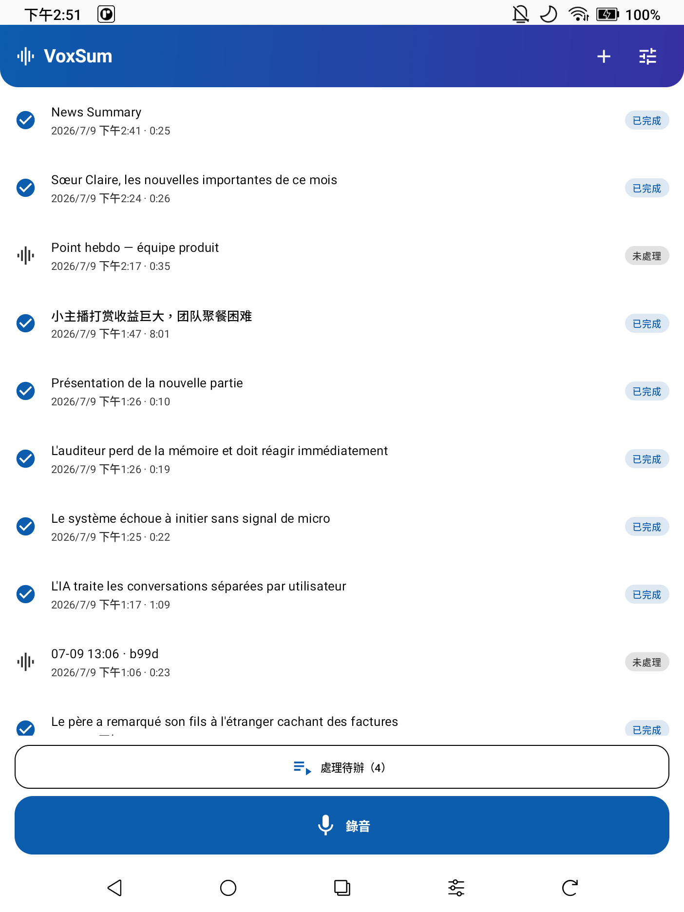
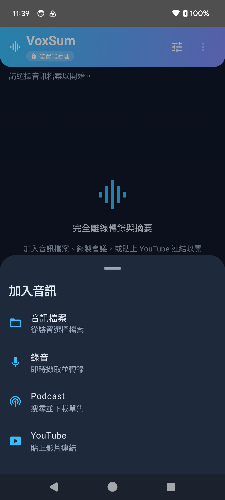
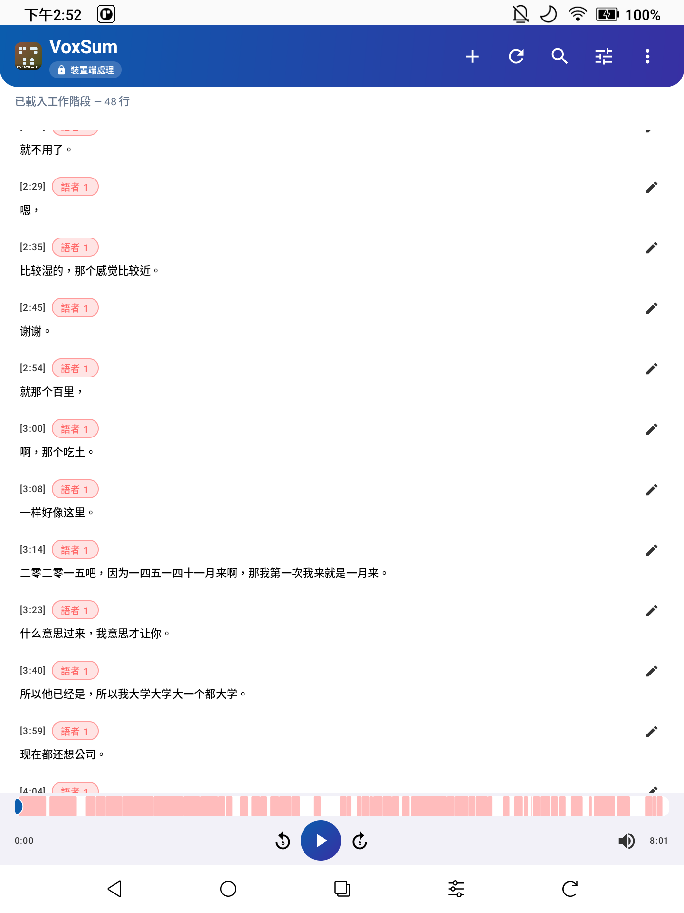
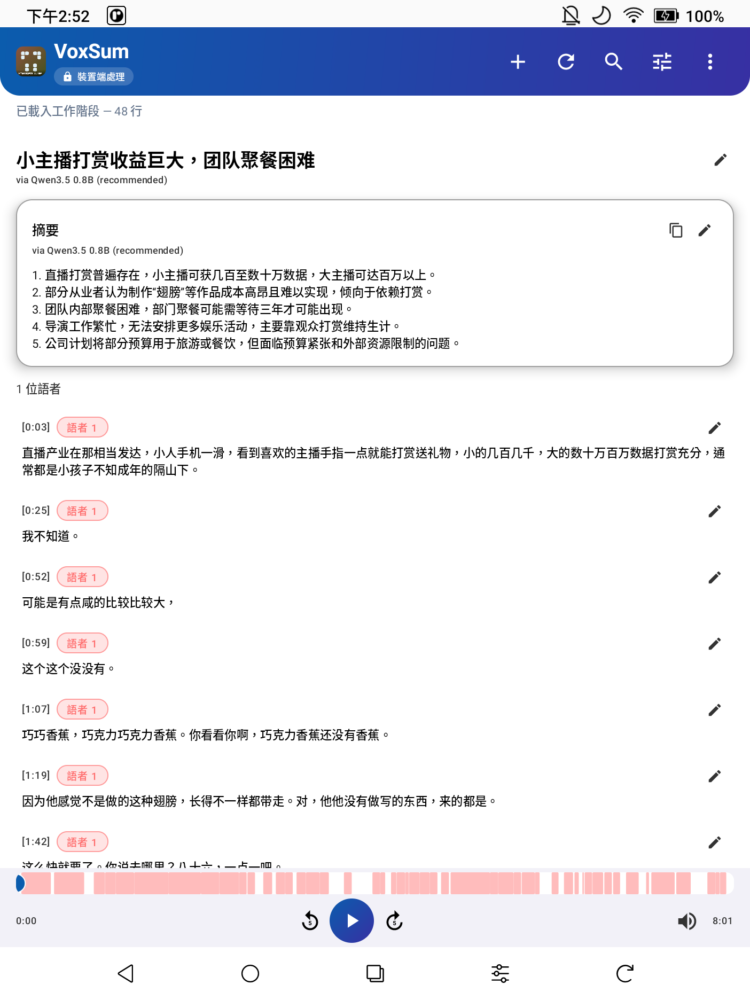

<p align="center">
  
</p>

<h1 align="center">VoxSum for Android</h1>

<p align="center">
  <b>轉錄 · 語者分離 · 摘要 — 完全在裝置端、完全離線。</b>
</p>

<p align="center">
  <a href="https://github.com/vieenrose/VoxSumDroid/releases/latest"></a>
  
  
  
</p>

<p align="center"><a href="README.md">English →</a></p>

---

VoxSum 把音訊 — 檔案、Podcast 單集或 YouTube 連結 — 轉成標註語者的逐字稿與精簡摘要，
而且全部在**手機上**完成。語音辨識、語者分離與 LLM 摘要皆於本機執行；無伺服器、無帳號、無雲端。
本專案為 [VoxSum Studio](https://huggingface.co/spaces/Luigi/VoxSum-bak) 的裝置端移植版。

> 已在 Pixel 6 端到端驗證：VAD 分段 ASR → 語者分離 → 摘要，並搭配與逐字稿同步的播放器。
> 以 **APK** 形式於 [Releases](https://github.com/vieenrose/VoxSumDroid/releases) 發佈。

## 為什麼選擇 VoxSum

這不只是一款 App，更是對逐字稿的另一種主張 —— **你的話語，仍屬於你。**

| 🛡️ 絕對隱私 | ✈️ 完全離線 | 💰 無需訂閱 |
| :-- | :-- | :-- |
| 音訊永不離開您的裝置；所有步驟皆在本機處理，機密錄音不會外洩到雲端。 | 模型就緒後即無需網路 —— 在飛機、高鐵或任何無訊號之處皆可使用。 | 一次擁有，永久使用。無用量計費、無週期性費用。 |

## 螢幕截圖

| 首頁 | 加入來源 | 逐字稿 | 摘要 |
| :--: | :--: | :--: | :--: |
|  |  |  |  |

## 功能特色

**擷取**
- **四種語音辨識後端**，每次執行可自選 —— SenseVoice（多語言：中／英／日／韓／粵）、Moonshine（英語、快速）、Zipformer zh-en、Qwen3-ASR（高準確度）。
- **即時錄音** —— 錄製會議並邊說邊轉錄；逐句串流出現，停止後再執行語者分離與摘要。
- **Podcast 與 YouTube** —— 搜尋並下載 Podcast 單集（iTunes + RSS），或貼上 YouTube 連結（以 NewPipeExtractor 解析）直接進入流程。

**理解**
- **串流轉錄** —— 偵測到語音即逐句顯示（Silero VAD）。
- **語者分離** —— 每句以 CAM++（中＋英）嵌入搭配自適應分群，並提供彩色時間軸、各語者色票與統計面板。fp16 嵌入模型由裝置端實測選定 —— 在中／英語上比舊基準約快 1.5 倍且更準確（[權重與基準測試](https://huggingface.co/Luigi/campplus-zh-en-onnx)）。
- **裝置端摘要** —— 透過 llama.cpp 執行本機 GGUF 模型，產生標題與 Markdown 摘要。可選 Gemma 系列：Gemma 3（270M／1B）、Gemma 3n（E2B／E4B）、Gemma 4（E2B／E4B）。

**運用**
- **與逐字稿同步的播放器**，如音樂播放器般固定於底部 —— 點任一句即可跳轉，作用中該句自動高亮，且轉錄進行中即可播放。
- **行內編輯** —— 可直接編輯句子文字與重新命名語者。
- **匯出** —— 逐字稿匯出為 SRT／VTT／TXT／JSON，摘要匯出為 Markdown／純文字。
- **雙語（English／繁體中文）** —— UI 全面在地化，並可選擇繁體中文（OpenCC `s2tw`）輸出逐字稿與摘要。

## 運作方式

```
音訊 ─► VAD (Silero) ─► ASR (sherpa-onnx) ─► 語者分離 (CAM++ + 分群) ─► 摘要 (llama.cpp + Gemma)
```

各階段以串流方式即時更新 UI，不會卡在整個流程上。模組對應請見 [`ARCHITECTURE.md`](ARCHITECTURE.md)。

## 技術堆疊

技術細節與授權對照見[英文說明](README.md#tech-stack)。

## 安裝

從 [**Releases 頁面**](https://github.com/vieenrose/VoxSumDroid/releases/latest) 下載最新的已簽署 APK 後側載安裝。
模型**不**內建，會在首次使用時下載一次（並經 SHA-256 驗證），之後即可完全離線使用。

## 從原始碼建置

建置步驟見[英文說明](README.md#build-from-source)。

## 授權

[GPL-3.0-or-later](LICENSE)。內含的原始碼相依套件各自保留其授權。
