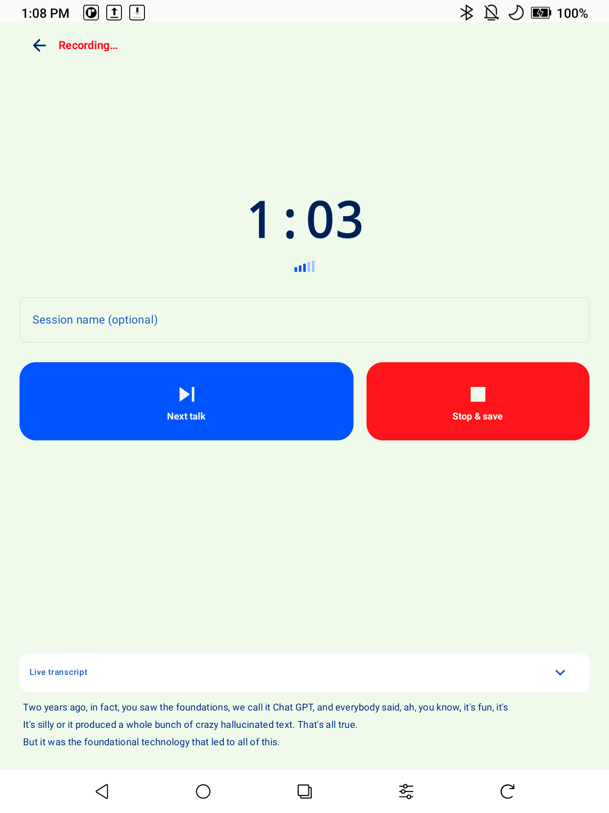
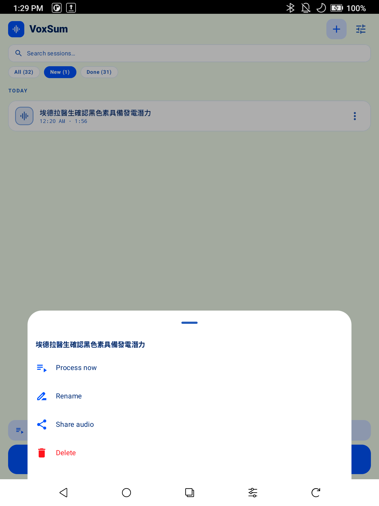

  

<h1 align="center">VoxSum — Démarrage rapide</h1>

<i>Transformez n'importe quel audio en une transcription avec intervenants et un résumé concis — entièrement sur votre téléphone, hors ligne.</i>

<b>Démarrage rapide en :</b><a href="QUICKSTART.md">English</a> · <a href="QUICKSTART.zh-TW.md">繁體中文</a> · Français

<a href="../README.fr.md">← Retour au README</a>

---

Voici un tour en 5 minutes de tout ce que VoxSum sait faire. Rien ici ne nécessite de compte, et après le téléchargement unique des modèles, plus rien ne quitte votre téléphone.

> **Le premier lancement télécharge des modèles.** À la première transcription, VoxSum récupère le modèle de reconnaissance vocale ; au premier résumé, le modèle de résumé (depuis Hugging Face, avec vérification d'intégrité). Une barre de progression suit le téléchargement. Ensuite, vous pouvez passer entièrement hors ligne. Si un téléchargement échoue ou qu'un modèle est corrompu, VoxSum le nettoie et affiche un **Réessayer** en un geste.

<i>L'accueil studio : chaque session avec son statut en direct — <b>Non traité</b>,
<b>En attente</b>, <b>Traitement</b> (phase et progression), <b>Terminé</b> — plus le grand bouton
<b>Enregistrer</b> et <b>Traiter en attente (n)</b>.</i>

## 1. Enregistrer — une session, ou toute une journée

Touchez le grand bouton **🎙 Enregistrer**. Vous arrivez dans la cabine d'enregistrement : un grand minuteur, des barres de niveau micro, un champ **nom de la session** facultatif (votre nom prime définitivement sur le titre généré par l'IA), et deux boutons géants :

<i>La cabine d'enregistrement. Le bandeau repliable <b>Transcription en direct</b> montre les dernières lignes reconnues — la preuve que le micro vous entend.</i>

- **⏭ Session suivante** — termine cette session et **démarre immédiatement la suivante**. La capture terminée est auto-sauvegardée en *Non traité* ; son traitement lourd est différé. C'est le mode enchaîné : touchez-le entre chaque intervention d'une journée de réunions.
- **⏹ Arrêter et sauvegarder** — sauvegarde la capture et la traite **en arrière-plan** : vous revenez à la liste des sessions et voyez sa ligne passer *Traitement → Terminé*, tout en étant déjà libre de réenregistrer.

**Impossible de perdre un enregistrement.** L'audio est sauvegardé dans la bibliothèque dès que le micro s'arrête — un geste malheureux, un plantage ou le système qui tue l'appli en pleine réunion ne vous coûte rien (une capture interrompue est récupérée et sauvegardée au prochain lancement).

L'enregistrement continue si vous revenez à la liste — un bandeau rouge **Enregistrement** vous y ramène.

### Traiter quand vous voulez

Les sessions différées attendent en *Non traité*. Touchez **Traiter en attente (n)** (en bas de l'accueil, ou dans la feuille ➕) : VoxSum les transcrit, identifie les locuteurs, résume et titre toutes — chaque ligne affiche la phase et la progression en direct. Les lots sont traités **efficacement** : toutes les sessions sont d'abord transcrites, puis le modèle de résumé se charge **une seule fois** pour tout le lot au lieu d'une fois par session. La file survit aux arrêts de l'appli et reprend où elle en était — les transcriptions terminées ne sont jamais refaites. Ou traitez une seule session : touchez sa ligne → **Traiter maintenant**. Vous changez d'avis ? La feuille d'une session en attente propose **Retirer de la file**, et celle en cours **Arrêter le traitement**.

### Gérer vos sessions

Touchez une ligne *Non traité* (ou faites un appui long sur n'importe quelle ligne) pour la feuille de gestion :

<i>Actions par session : <b>Traiter maintenant · Renommer · Partager l'audio · Supprimer</b> (avec confirmation).</i>

Toucher une ligne **Terminé** ouvre la session complète — transcription, locuteurs, résumé, lecteur synchronisé.

## 2. Importer de l'audio d'ailleurs

Touchez **➕** dans la barre du haut. Choisissez une source :

| Source | À quoi ça sert |
|---|---|
| **Fichier audio** | N'importe quel audio/vidéo déjà sur votre téléphone — choisissez-le dans l'explorateur. |
| **Enregistrer** | La même cabine d'enregistrement que le grand bouton Enregistrer. |
| **Podcast** | Cherchez une émission, choisissez un épisode, et transcrivez-le. |
| **YouTube** | Collez un lien, ou cherchez par mot-clé. |
| **Ouvrir une session (.ogg / .m4a)** | Rouvrez un fichier de session reçu d'ailleurs et continuez à l'éditer. |

Vous pouvez aussi **partager** une note vocale ou un fichier audio/vidéo *vers* VoxSum depuis une autre appli (LINE, WhatsApp, un dictaphone, votre navigateur) — VoxSum apparaît dans le menu de partage et démarre la transcription.

<i>Les sources d'entrée, plus des raccourcis vers la liste des sessions et la file de traitement.</i>

### Transcrire un podcast
**➕ → Podcast.** Tapez le nom d'une émission, choisissez un épisode, et il se télécharge puis se transcrit.

### Transcrire une vidéo YouTube
**➕ → YouTube.** Collez l'URL d'une vidéo (ou tapez des mots-clés pour chercher), choisissez le résultat, et l'audio est extrait puis transcrit.

## 3. Lire et comprendre

  
  &nbsp;
  

<i>À gauche : le titre, un résumé en puces, la transcription étiquetée par intervenant et le lecteur synchronisé. À droite : touchez 🔍 pour chercher — les résultats se surlignent et vous les parcourez.</i>

- **Qui a parlé, et quand** — chaque ligne est étiquetée et colorée par intervenant, leur nombre est détecté automatiquement (un segmenteur neuronal trace des frontières de locuteurs précises). VoxSum peut **deviner le vrai nom des intervenants** d'après leurs propos (barre du haut, menu ↻ → *Détecter les noms*), et *Redétecter les locuteurs* ne relance que l'analyse des locuteurs — sans retranscrire.
- **Lecteur synchronisé** — ancré en bas comme une appli musicale : touchez une ligne pour y sauter ; la ligne en cours se surligne pendant la lecture.
- **Recherche** — touchez le 🔍 de la barre du haut pour trouver n'importe quel mot dans un long enregistrement ; les résultats se surlignent et se parcourent avec les flèches haut/bas.
- **Un résumé à votre façon** — un titre court et un résumé en **puces, en synthèse ou en récit** (choisissez le style dans **Paramètres**), dans la langue de votre choix. (la langue du résumé est indépendante de celle de l'audio.)
- **Actions à mener** — barre du haut, menu ↻ → *Extraire les actions* : tire d'une réunion une liste (brouillon) de qui-fait-quoi et des décisions clés.

## 4. Personnaliser

<i>Le menu ↻ de la barre du haut : re-transcrire, re-résumer, redétecter les noms, ou extraire les actions.</i>

- **Modifiez tout** — corrigez un mot, renommez un intervenant, ou ajustez le titre/résumé, sur place.
- **Corrigez les intervenants** — sur n'importe quelle ligne, le menu ⇄ déplace une ligne mal attribuée vers la bonne personne, ou fusionne deux intervenants.
- **Relancez** — le menu ↻ de la barre du haut relance la transcription, le résumé, la détection des noms, ou l'extraction des actions. VoxSum suit aussi les dépendances entre contenus : changez la langue ou le style du résumé, ou modifiez la transcription, et il propose un **re-résumé** en un geste (qui rafraîchit aussi le titre, sauf si vous l'avez écrit vous-même). Un simple passage entre **繁體中文 ↔ 简体中文** convertit le titre, le résumé et la transcription **instantanément**, sans relance.

## 5. Enregistrer, partager, exporter

<i>Le menu Exporter : enregistrer/partager toute la session en <code>.ogg</code> ou <code>.m4a</code>, ou exporter la transcription en texte, sous-titres, Markdown ou PDF.</i>

Ouvrez le menu **⋮ (Exporter)** de la barre du haut. (Pendant une transcription, les exports et les réglages sont brièvement verrouillés pour éviter d'enregistrer une session à moitié finie — ils se déverrouillent dès la fin.)

- **Enregistrer / Partager la session (.ogg ou .m4a)** — réunit toute la session (audio + transcription + résumé + intervenants + une pochette) dans un seul `.ogg` *ou* `.m4a` qui **se lit dans n'importe quelle appli musicale** (en affichant le titre, la pochette et la transcription en paroles) et **se rouvre dans VoxSum** avec tout intact. C'est votre archive — rouvrez-la quand vous voulez via *Ajouter de l'audio → Ouvrir une session*. Choisissez `.m4a` pour la compatibilité maximale (iPhone, autoradios, tous les lecteurs).
- **Copier / Partager la transcription** — amenez le texte dans n'importe quelle autre appli.
- **Enregistrer en texte / sous-titres / Markdown / PDF** — `.txt`, `.srt`, `.vtt`, `.md`, ou un `.pdf` imprimable, pour documents, sous-titres ou notes.

Gérez les modèles téléchargés (et récupérez de l'espace) à tout moment dans **Paramètres → Stockage**.

Chaque session vit dans la liste de l'accueil — rouvrez une session **Terminé** à tout moment d'un toucher.

## 6. Réglages à connaître

  
  &nbsp;
  

<i>À gauche : langue + style du résumé. À droite : <b>Stockage</b> (espace disque par modèle, avec bouton de suppression) et <b>À propos</b> (version, licence, composants open source).</i>

- **Apparence** — **Clair**, **Sombre**, ou **E-ink** (un thème plat à fort contraste pour les liseuses comme Boox). **Auto** — le réglage par défaut — suit le mode clair/sombre du système.
- **Langue du résumé** — gardez la langue de la transcription, ou choisissez English · Français · 繁體中文 · 简体中文 · 日本語 · 한국어.
- **Style du résumé** — Puces / Synthèse / Récit.
- **Moteur de transcription** — chinois + anglais par défaut ; un moteur multilingue (chinois · anglais · japonais · coréen · cantonais) est à un toucher.
- **Intervenants** — activez/désactivez la séparation des locuteurs, ou indiquez leur nombre.
- **Stockage** — voyez l'espace disque utilisé par chaque modèle et supprimez-en pour récupérer de la place (il se retéléchargera à la prochaine utilisation).

---

<i>Tout ce qui précède s'exécute sur l'appareil. Sans compte, sans cloud, sans abonnement.</i>

