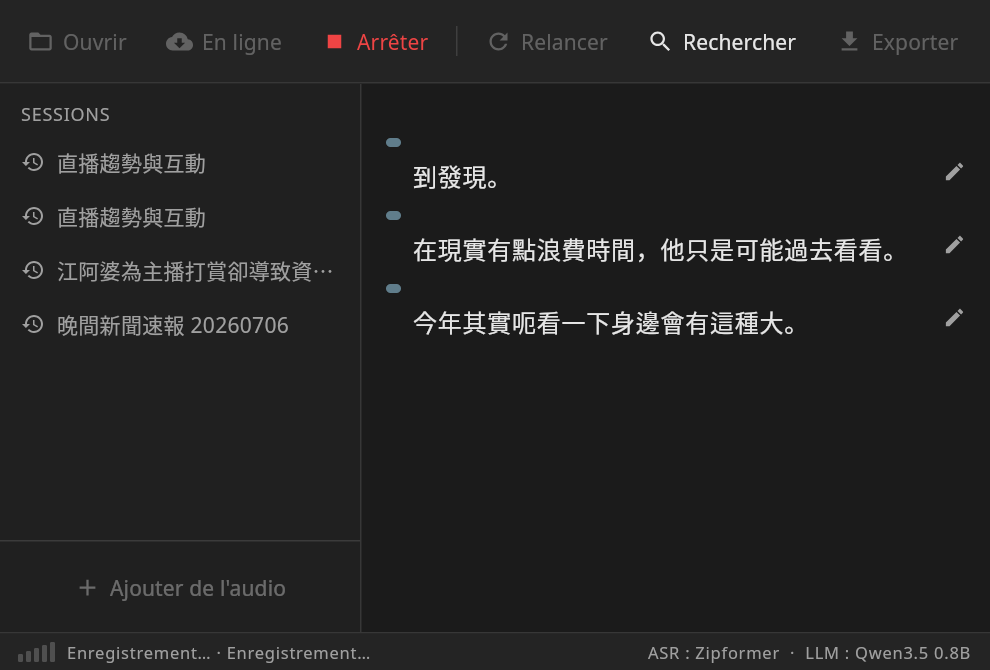
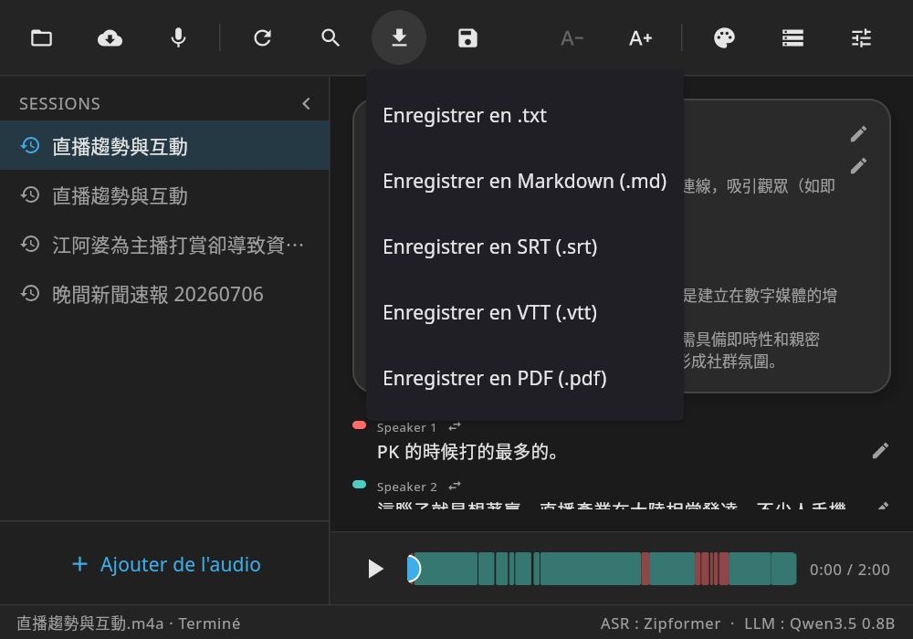

<h1 align="center">VoxSum for Linux — Quick Start</h1>

<p align="center"><i>Turn any audio into a speaker-labelled transcript and a short summary — entirely on your machine, offline.</i></p>

<p align="center"><b>Quick Start in:</b> English · <a href="QUICKSTART.zh-TW.md">繁體中文</a> · <a href="QUICKSTART.fr.md">Français</a></p>
<p align="center"><a href="../README.md">← Back to README</a></p>

---

This is a 5-minute tour of everything the desktop app can do. Nothing here needs an account, and after the one-time model download nothing leaves your computer.

## Install & launch

<p align="center"></p>

```bash
sudo dpkg -i voxsum_<version>_amd64.deb    # from the desktop-v* GitHub release
```

The app installs to `/opt/voxsum` and adds a **VoxSum** entry to your application menu (AudioVideo). It needs system **`ffmpeg`** on `PATH` for audio decode and playback — install it from your distro if it isn't already (`sudo apt install ffmpeg`). Launch it from the menu, or run `/opt/voxsum/bin/VoxSum`.

> **First run downloads models.** The first time you transcribe, VoxSum fetches the speech + speaker models; the first time you summarize, it fetches the summary model (from Hugging Face, integrity-checked, into `~/.local/share/VoxSum`). A progress bar shows the download. After that you can go fully offline. If a download breaks, VoxSum cleans it up and lets you retry.

## 1. Bring in audio

Click **➕ Add audio** (the hero button on the empty screen, or **Ouvrir / Open** in the top bar) and pick a source:

| Source | What it's for |
|---|---|
| **Audio file** | Any audio/video already on your computer — pick it with the native file dialog. |
| **Record** | Capture a meeting live and watch the transcript appear as you speak. |
| **Online → Podcast** | Search a show, pick an episode, and transcribe it. |
| **Online → YouTube** | Paste a link or search by keyword. |
| **Open session (.m4a / .ogg)** | Reopen a session you saved earlier and keep editing. |

<p align="center"></p>

**Record a meeting** — *Record* captures from your system's default input device; lines appear as you talk, small **level bars** in the status bar show that the mic hears you, and **Stop** finishes the summary. Too-quiet sources (far-field room mics) get an automatic volume boost — for transcription *and* playback.

<p align="center"></p>

## 2. Read and understand

<p align="center"></p>

- **Who spoke when** — every line is tagged and colour-coded by speaker, and the player bar shows a per-speaker colour timeline. The number of speakers is detected **automatically** — a neural segmenter draws the speaker boundaries and the count comes from the voice-similarity structure; you don't set a threshold. Long passes show a live **time-to-finish estimate** ("Identifying speakers… ≈3 min left"), and so does summarization. VoxSum can also **guess speakers' real names** from what they say (top-bar **↻ Re-run → Detect names**).
- **Synced player** — docked at the bottom like a music app: click any line to jump there; the current line highlights as it plays, and the transcript **auto-scrolls** to keep it in view.
- **Search** — the 🔍 in the top bar finds any word in a long recording; matches highlight and you step through them.
- **Comfortable text size** — the **A− / A+** buttons scale the transcript, title, and summary (the toolbar and player stay put). HiDPI screens are auto-detected; override with `VOXSUM_UI_SCALE=1.5` if detection guesses wrong.
- **Summary, your way** — a short title plus a concise summary (at most a handful of points, rendered as proper **Markdown**, folded behind *Show more* when long) as **bullets, an executive brief, or a narrative** (pick the style in Settings), in the language you choose. Summary language is independent of the audio — e.g. an English summary over a Chinese transcript.
- **Action items** — top-bar **↻ Re-run → Extract action items** pulls a draft checklist of who-does-what and the key decisions out of a meeting.

## 3. Make it yours

- **Edit anything** — fix a word, rename a speaker, or tweak the title/summary in place.
- **Fix the speakers** — on any line, the ⇄ menu moves a misattributed line to the right person or merges two speakers into one.
- **Re-run** — the top-bar **↻** menu re-runs transcription, the summary, **speaker detection alone** (*Re-detect speakers* — no full re-transcribe needed), name detection, or action-item extraction, and tracks what depends on what: change the summary language or style, or edit the transcript, and it offers a one-tap re-summarize. Switching only between **繁體中文 ↔ 简体中文** converts the title, summary, and transcript **instantly** — no re-run needed.

## 4. Save, share, export

<p align="center"></p>

Open the **Export** menu (top bar). While a transcription is still running, export and settings are briefly locked so a session can't be saved half-finished — they unlock on completion.

- **Save session (.m4a or .ogg)** — packs the whole session (audio + transcript + summary + speakers + a cover) into one file that **plays in any media player** (showing title, cover, and the transcript as synced lyrics) and **reopens in VoxSum** with everything intact. `.m4a` is the default and matches what the Android app writes, so a session moves between desktop and phone. This is your archive — reopen it any time via *Add audio → Open session*.
- **Export the transcript** — plain text (`.txt`), subtitles (`.srt`, `.vtt`), Markdown (`.md`), or a printable **PDF** (with CJK support when a system Noto Sans CJK font is present).

Reopened and saved sessions appear under **Recent** in the sidebar, one click to continue.

## 5. Settings worth knowing

<p align="center"></p>

- **Appearance** — **Light**, **Dark**, or **E-ink** (a flat, high-contrast theme). **Auto** follows your system light/dark setting.
- **Summary language** — keep the transcript's language, or pick English · Français · 繁體中文 · 简体中文 · 日本語 · 한국어.
- **Summary style** — Bullets / Executive / Narrative.
- **Transcription engine** — Chinese + English by default; a multilingual engine (Chinese · English · Japanese · Korean · Cantonese) is one click away.
- **Speakers** — turn diarization on/off, or hint a fixed number of speakers (otherwise the count is automatic).
- **Models** — see how much disk each downloaded model uses and delete any to reclaim space (it re-downloads on next use).

---

<p align="center"><i>Everything above runs on your machine. No account, no cloud, no subscription.</i></p>
