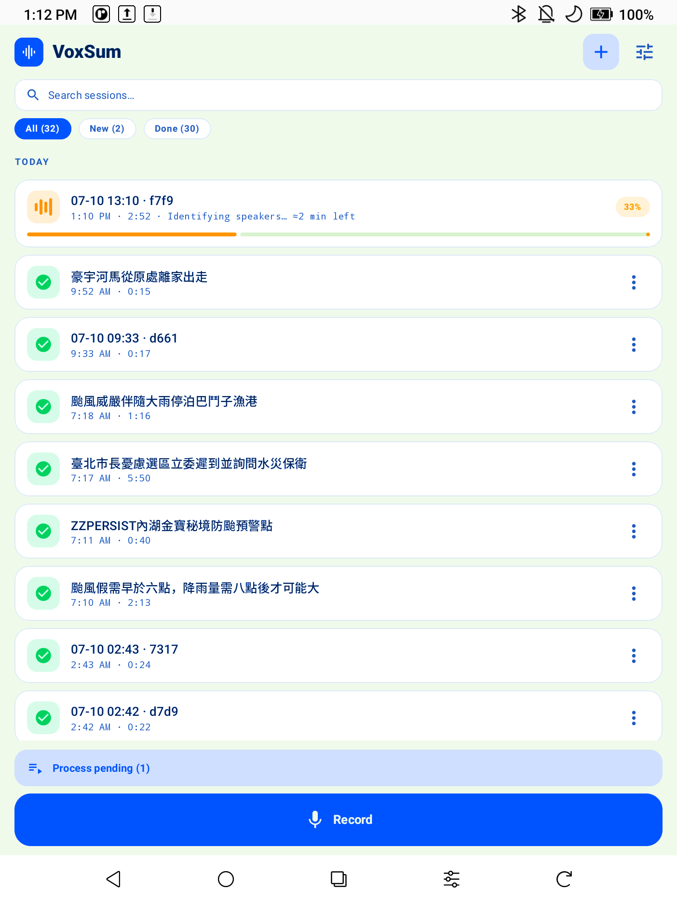
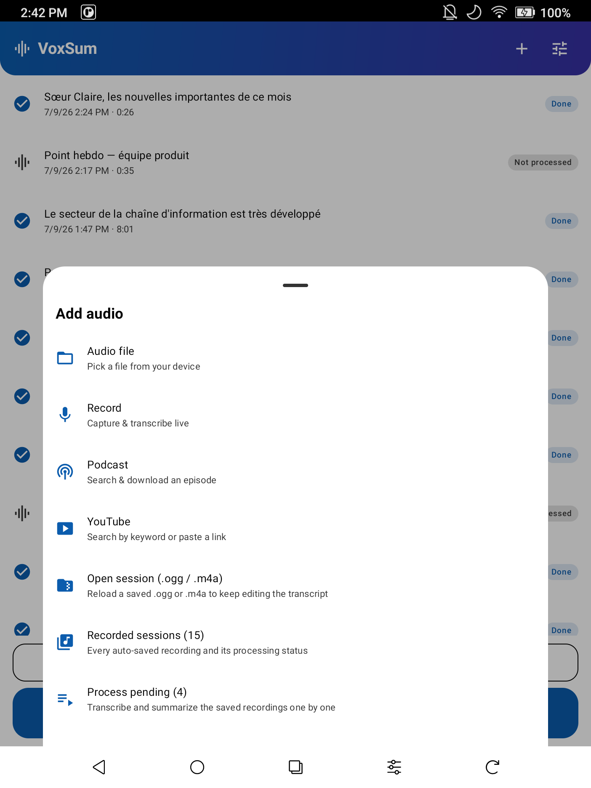
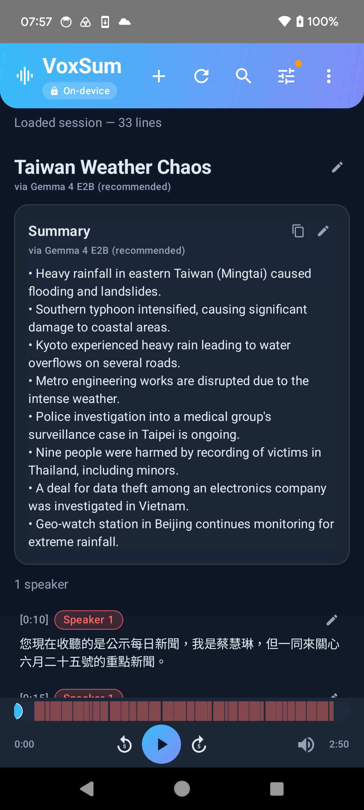
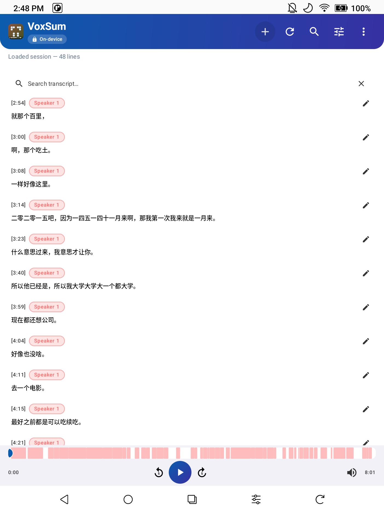
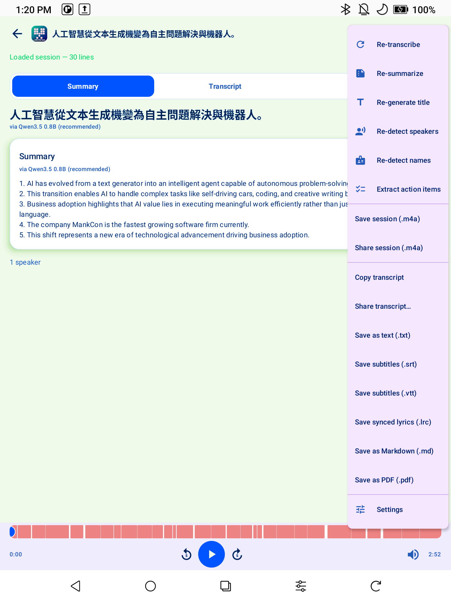
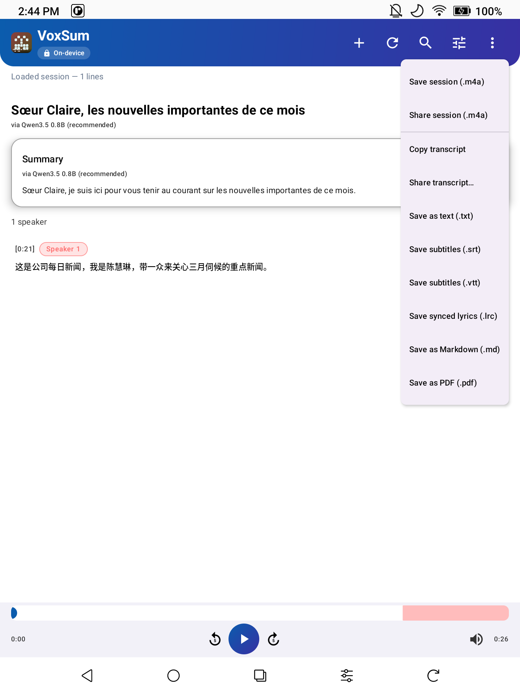
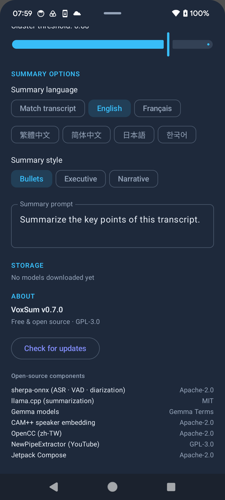
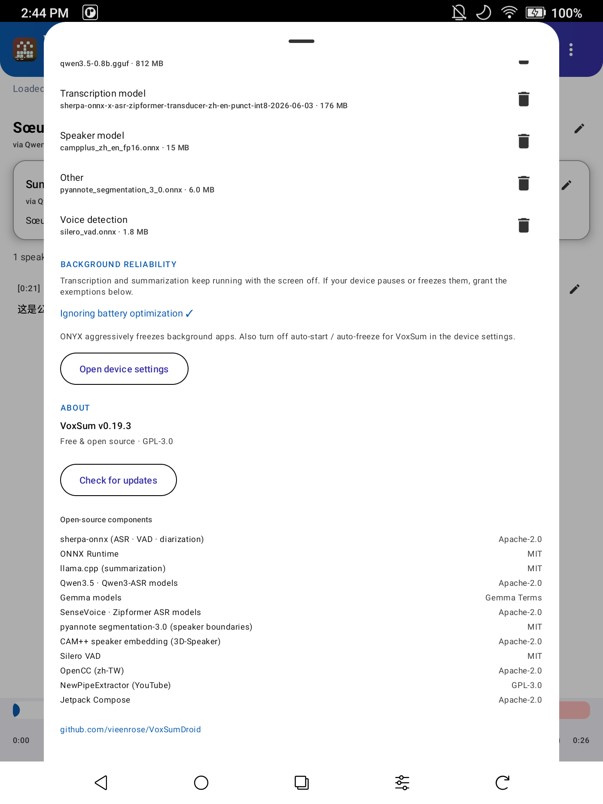

  

<h1 align="center">VoxSum — Quick Start</h1>

<i>Turn any audio into a speaker-labelled transcript and a short summary — entirely on your phone, offline.</i>

<b>Quick Start in:</b> English · <a href="QUICKSTART.zh-TW.md">繁體中文</a> · <a href="QUICKSTART.fr.md">Français</a>

<a href="../README.md">← Back to README</a>

---

This is a 5-minute tour of everything VoxSum can do. Nothing here needs an account, and after the
one-time model download nothing leaves your phone.

> **First run downloads models.** The first time you transcribe, VoxSum fetches the speech model; the
> first time you summarize, it fetches the summary model. A progress bar shows the download. After
> that you can go fully offline.

<i>The home screen: the offline promise up front, one <b>Add audio</b> button, and your
<b>Recent</b> sessions one tap away.</i>

## 1. Bring in audio — five ways

Tap **➕ Add audio** (the button on the home screen, or the **+** in the top bar). Pick a source:

| Source | What it's for |
|---|---|
| **Audio file** | Any audio/video already on your phone — pick it with the file browser. |
| **Record** | Capture a meeting live and watch the transcript appear as you speak. |
| **Podcast** | Search a show, pick an episode, and transcribe it. |
| **YouTube** | Paste a link or search by keyword. |
| **Open session (.ogg / .m4a)** | Reopen a session you saved earlier and keep editing. |

You can also **Share** a voice note or audio/video file *to* VoxSum from another app (LINE, WhatsApp,
a recorder, your browser) — VoxSum appears in the share sheet and starts transcribing.

<i>The five input sources. "Open session" reopens a saved <code>.ogg</code> or <code>.m4a</code>.</i>

### Record a meeting
**Add audio → Record.** Grant the microphone permission the first time. Lines appear as you talk; tap
**Stop** when you're done and VoxSum finishes the summary. You can read and play back before it ends.

### Transcribe a podcast
**Add audio → Podcast.** Type a show name, pick an episode, and it downloads and transcribes.

### Transcribe a YouTube video
**Add audio → YouTube.** Paste a video URL (or type keywords to search), pick the result, and it pulls
the audio and transcribes it.

## 2. Read and understand

  
  &nbsp;
  

<i>Left: the title, a bullet summary, the speaker-tagged transcript and the synced
player. Right: tap 🔍 to search — matches highlight and you step through them.</i>

- **Who spoke when** — each line is tagged and colour-coded by speaker, with a speaker count. VoxSum
  can **guess speakers' real names** from what they say (top-bar ↻ menu → *Detect names*).
- **Synced player** — docked at the bottom like a music app: tap any line to jump there; the current
  line highlights as it plays.
- **Search** — tap the 🔍 in the top bar to find any word in a long recording; matches highlight and
  you can step through them with the up/down arrows.
- **Summary, your way** — a short title and a summary as **bullets, an executive brief, or a
  narrative** (pick the style in **Settings**), in the language you choose. (Notice the screenshot: an
  English summary over a Chinese transcript — summary language is independent of the audio.)
- **Action items** — top-bar ↻ menu → *Extract action items* pulls a draft checklist of who-does-what
  and the key decisions out of a meeting.

## 3. Make it yours

<i>The top-bar ↻ menu: re-transcribe, re-summarize, re-detect names, or extract action items.</i>

- **Edit anything** — fix a word, rename a speaker, or tweak the title/summary right in place.
- **Fix the speakers** — on any line, the ⇄ menu lets you move a misattributed line to the right
  person or merge two speakers into one.
- **Re-run** — the top-bar ↻ menu re-runs transcription, the summary, name detection, or action-item
  extraction (e.g. switch the summary language, then re-summarize).

## 4. Save, share, export

<i>The Export menu: save/share the whole session as <code>.ogg</code> or <code>.m4a</code>,
or export the transcript as text, subtitles, Markdown, or PDF.</i>

Open the **⋮ (Export)** menu in the top bar:

- **Save / Share session (.ogg or .m4a)** — packs the whole session (audio + transcript + summary +
  speakers + a cover) into one `.ogg` *or* `.m4a` that **plays in any music app** (showing the title,
  cover, and the transcript as lyrics) and **reopens in VoxSum** with everything intact. This is your
  archive — reopen it any time via *Add audio → Open session*. Choose `.m4a` for the widest player
  compatibility (iPhones, cars, every app).
- **Copy / Share transcript** — get the text into any other app.
- **Save as text / subtitles / Markdown / PDF** — `.txt`, `.srt`, `.vtt`, `.md`, or a printable `.pdf`
  for documents, captions, or notes.

Manage downloaded models (and reclaim space) any time under **Settings → Storage**.

Saved and reopened sessions show up under **Recent** on the home screen, one tap to continue.

## 5. Settings worth knowing

  
  &nbsp;
  

<i>Left: summary language + style. Right: <b>Storage</b> (per-model disk usage with a
delete button) and <b>About</b> (version, license, open-source components).</i>

- **Summary language** — keep the transcript's language, or pick English · Français · 繁體中文 ·
  简体中文 · 日本語 · 한국어.
- **Summary style** — Bullets / Executive / Narrative.
- **Transcription engine** — Chinese + English by default; a multilingual engine (Chinese · English ·
  Japanese · Korean · Cantonese) is one tap away.
- **Speakers** — turn diarization on/off or hint the number of speakers.
- **Storage** — see how much disk each model uses and delete any to reclaim space (it re-downloads on
  next use).

---

<i>Everything above runs on the device. No account, no cloud, no subscription.</i>

