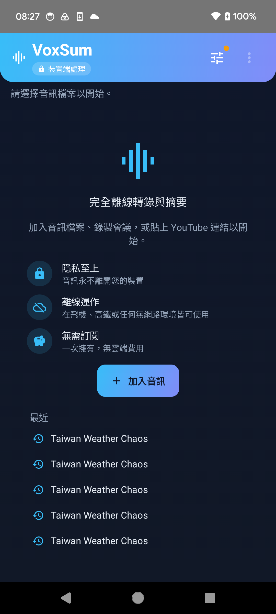
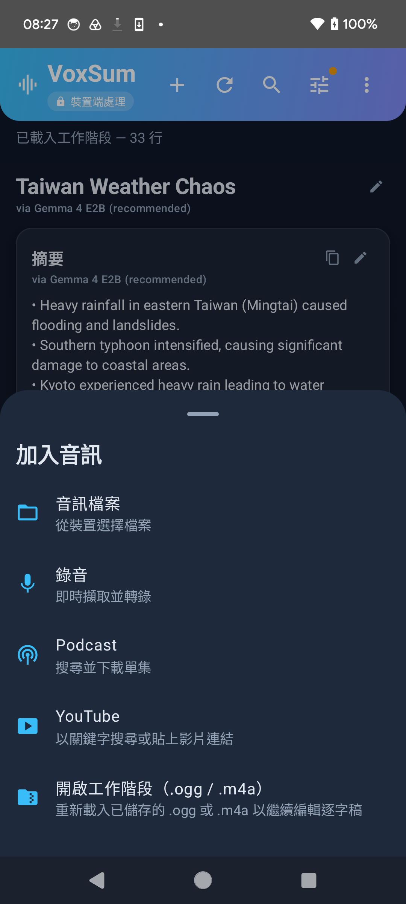
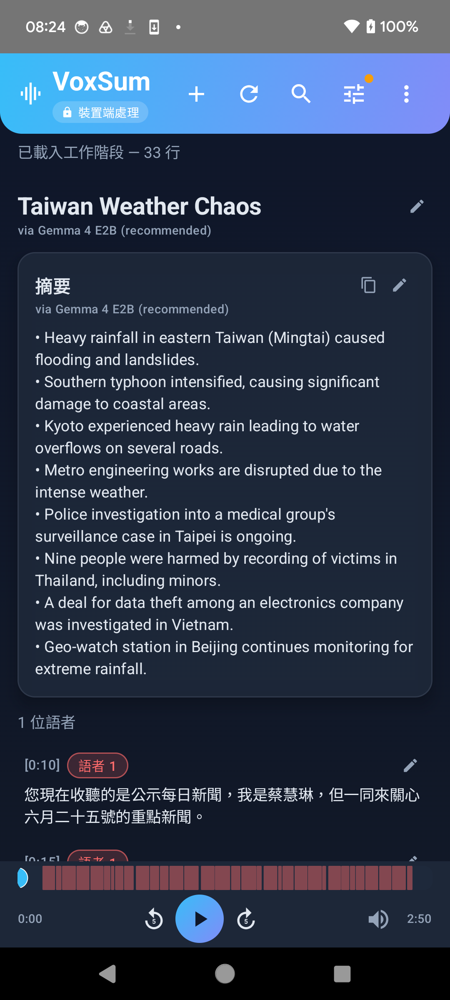
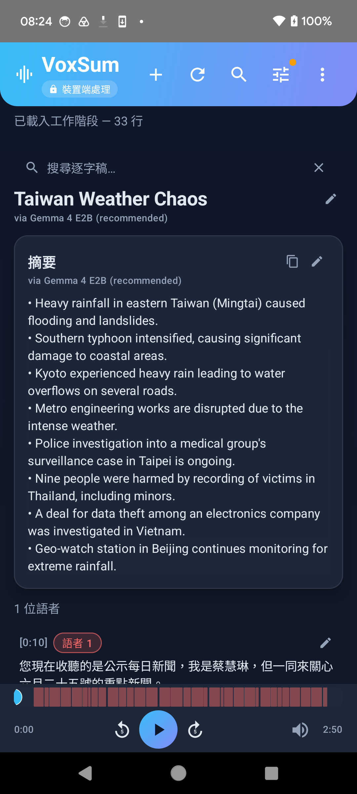
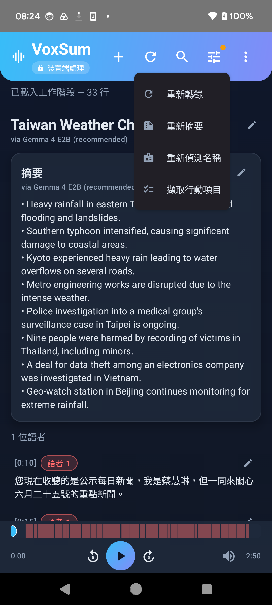
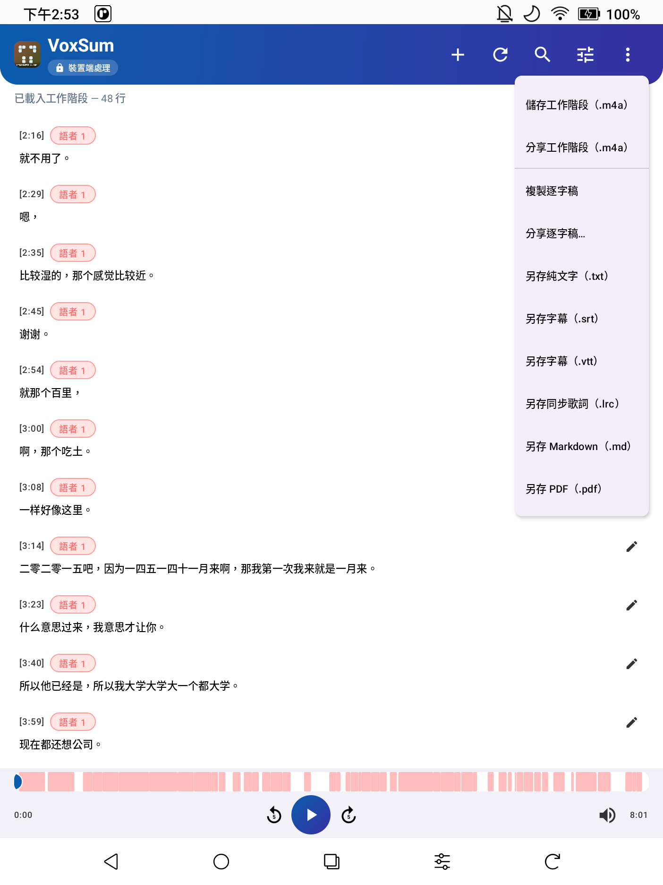
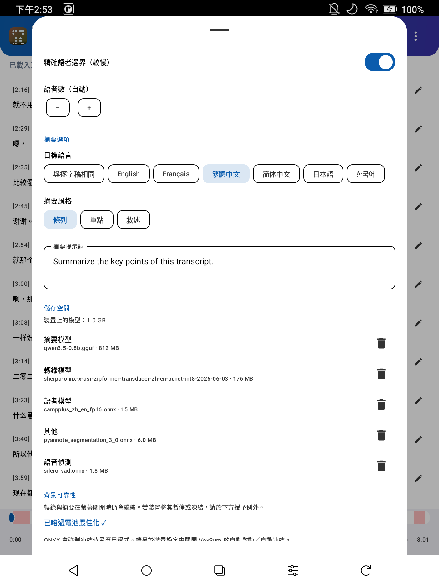
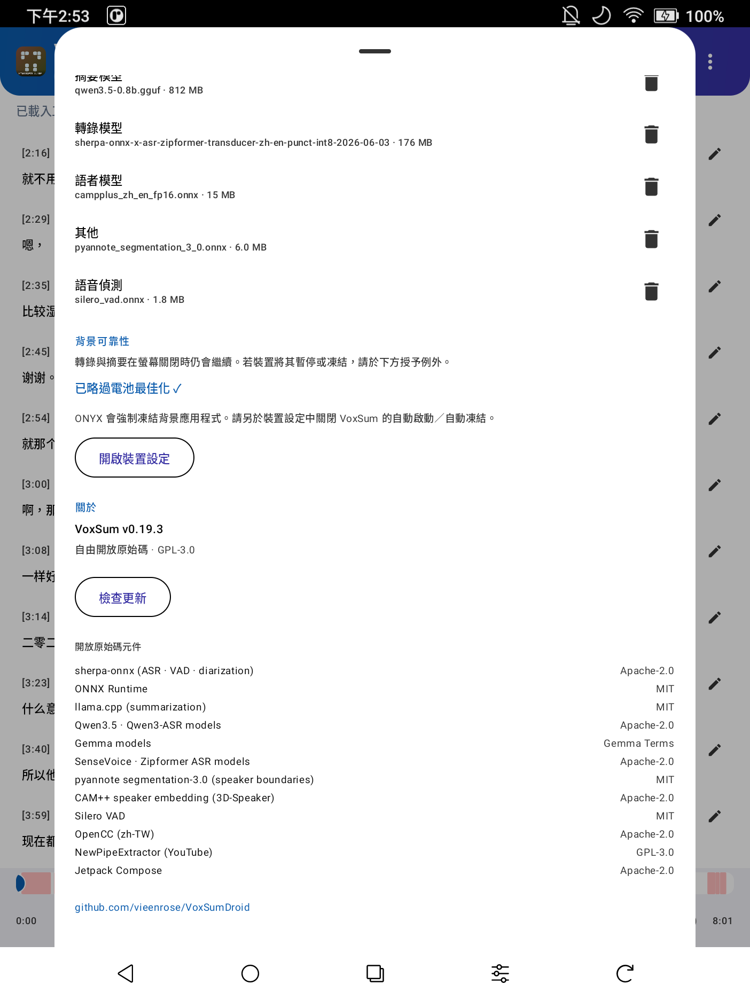

  

<h1 align="center">VoxSum — 快速上手</h1>

<i>把任何聲音變成標註語者的逐字稿與精簡摘要 —— 全程在手機上完成，完全離線。</i>

<b>快速上手語言：</b><a href="QUICKSTART.md">English</a> · 繁體中文 · <a href="QUICKSTART.fr.md">Français</a>

<a href="../README.zh-TW.md">← 回到說明文件</a>

---

這是一段 5 分鐘導覽，帶你看過 VoxSum 的所有功能。全程無需帳號；模型只下載一次，之後便不再有任何資料離開你的手機。

> **首次執行會下載模型。** 第一次轉錄時，VoxSum 會下載語音模型；第一次摘要時，下載摘要模型。下載過程會顯示進度條。完成後即可完全離線使用。

<i>首頁：離線承諾一目了然、一個<b>加入音訊</b>按鈕，以及一鍵即達的<b>最近</b>工作階段。</i>

## 1. 匯入音訊 —— 五種方式

點 **➕ 加入音訊**（首頁的按鈕，或頂部列的 **+**），選一個來源：

| 來源 | 用途 |
|---|---|
| **音訊檔案** | 手機裡任何音訊／影片 —— 用檔案瀏覽器挑選。 |
| **錄製** | 即時錄一場會議，一邊說話一邊看逐字稿出現。 |
| **Podcast** | 搜尋節目、挑一集，直接轉成逐字稿。 |
| **YouTube** | 貼上連結，或用關鍵字搜尋。 |
| **開啟工作階段（.ogg / .m4a）** | 重新開啟先前儲存的工作階段，繼續編輯。 |

你也可以從其他 App（LINE、WhatsApp、錄音 App、瀏覽器）把語音訊息或音訊／影片檔**分享**給 VoxSum —— VoxSum 會出現在分享選單裡並開始轉錄。

<i>五種輸入來源。「開啟工作階段」可重新開啟已儲存的 <code>.ogg</code> 或 <code>.m4a</code>。</i>

### 錄製會議
**加入音訊 → 錄製。** 首次使用請授予麥克風權限。說話時句子隨即出現；說完點 **停止**，VoxSum 便完成摘要。結束前就能先讀、先播放。

### 轉錄 Podcast
**加入音訊 → Podcast。** 輸入節目名稱、挑一集，便自動下載並轉錄。

### 轉錄 YouTube 影片
**加入音訊 → YouTube。** 貼上影片網址（或輸入關鍵字搜尋），選取結果，便擷取音訊並轉錄。

## 2. 閱讀與理解

  
  &nbsp;
  

<i>左：標題、條列摘要、依語者標註的逐字稿，以及同步播放器。右：點 🔍 搜尋 —— 符合處會高亮，可逐一切換。</i>

- **誰在何時說話** —— 每一句都依語者標註並以顏色區分，並顯示語者數量。VoxSum 還能**從談話內容推測語者的真實姓名**（頂部列 ↻ 選單 →《偵測名稱》）。
- **同步播放器** —— 像音樂播放器一樣固定在底部：點任一句即可跳到該處，播放時當下那一句會自動高亮。
- **搜尋** —— 點頂部列的 🔍，在長篇錄音中找出任何字詞；符合處會高亮，並可用上下箭頭逐一切換。
- **以你想要的方式呈現摘要** —— 一個簡短標題，以及**條列、重點或敘述**式的摘要（在**設定**裡選風格），並可用你選的語言。（注意截圖：中文逐字稿配英文摘要 —— 摘要語言與音訊無關。）
- **行動項目** —— 頂部列 ↻ 選單 →《擷取行動項目》，從會議中整理出「誰該做什麼」的待辦清單草稿與關鍵決議。

## 3. 隨你編輯

<i>頂部列 ↻ 選單：重新轉錄、重新摘要、重新偵測名稱，或擷取行動項目。</i>

- **任意修改** —— 改一個字、重新命名語者，或調整標題／摘要，都能直接在原處進行。
- **修正語者** —— 在任一句上，⇄ 選單可把標錯的句子改到正確的人，或把兩個語者合併為一個。
- **重新執行** —— 頂部列 ↻ 選單可重新執行轉錄、摘要、名稱偵測或行動項目擷取（例如換個摘要語言再重新摘要）。

## 4. 儲存、分享、匯出

<i>匯出選單：把整個工作階段存成或分享為 <code>.ogg</code> 或 <code>.m4a</code>，或將逐字稿匯出為純文字、字幕、Markdown 或 PDF。</i>

打開頂部列的 **⋮（匯出）** 選單：

- **儲存／分享工作階段（.ogg 或 .m4a）** —— 把整個工作階段（音訊＋逐字稿＋摘要＋語者＋封面）打包成一個 `.ogg` 或 `.m4a`，**在任何播放器都能播**（並顯示標題、封面，以及作為歌詞的逐字稿），**用 VoxSum 開啟時所有內容也完整保留**。這就是你的存檔 —— 隨時可透過《加入音訊 → 開啟工作階段》重新開啟。想要最廣的播放器相容性（iPhone、車機、各種 App）就選 `.m4a`。
- **複製／分享逐字稿** —— 把文字帶進任何其他 App。
- **存成純文字／字幕／Markdown／PDF** —— `.txt`、`.srt`、`.vtt`、`.md`，或可列印的 `.pdf`，供文件、字幕或筆記使用。

可隨時在**設定 → 儲存空間**管理已下載的模型（並回收空間）。

已儲存與重新開啟的工作階段會出現在首頁的**最近**清單，一鍵即可接續。

## 5. 值得認識的設定

  
  &nbsp;
  

<i>左：摘要語言＋風格。右：<b>儲存空間</b>（各模型的磁碟用量與刪除按鈕）與<b>關於</b>（版本、授權、開源元件）。</i>

- **外觀主題** —— **淺色**、**深色**，或**電子紙**（專為電子紙閱讀器如 Boox 設計的扁平高對比主題）。預設的**自動**會跟隨系統的明暗設定。
- **摘要語言** —— 與逐字稿同語言，或選 English · Français · 繁體中文 · 简体中文 · 日本語 · 한국어。
- **摘要風格** —— 條列／重點／敘述。
- **轉錄引擎** —— 預設中文＋英文；多語言引擎（中文 · 英文 · 日文 · 韓文 · 粵語）一鍵即可切換。
- **語者** —— 開關語者分離，或提示語者數量。
- **儲存空間** —— 查看每個模型佔用多少磁碟，並可刪除以回收空間（下次使用時會重新下載）。

---

<i>以上一切都在裝置端執行。無需帳號、無需雲端、無需訂閱。</i>

